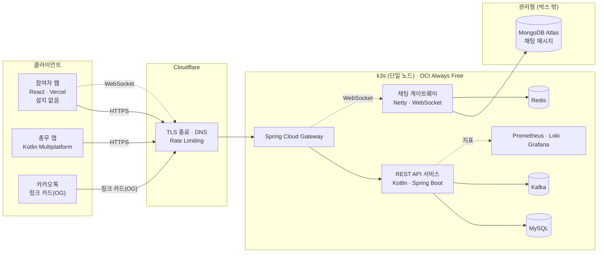
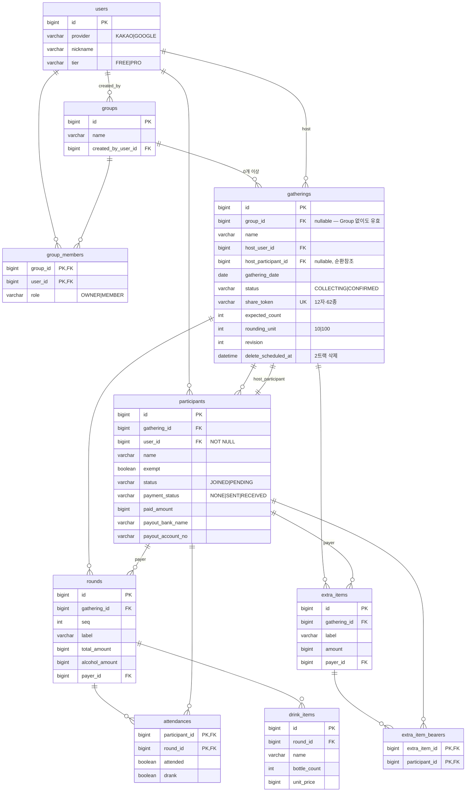

<div align="center">
  

  # 정산어택 (Jeongsan Attack)

  **1차, 2차로 끝나지 않는 술자리를 위한 정산 서비스**

  
  
  
  
  
  

</div>

---

## 왜 만들었나

술자리 정산은 나눗셈 문제가 아니라 **기록 문제**다.

1차는 다섯 명이 갔는데 2차는 셋만 갔다. 한 명은 술을 안 마셨고, 택시비는 두 명만
나눠 낸다. **여기서 총액을 인원수로 나누면(N빵) 누군가는 반드시 손해를 본다.**
그런데 제대로 계산하려면 *누가 어디에 있었는지*를 전부 알아야 하고, 그 정보는
총무의 기억 속에만 있다 — 기존 정산 앱들이 N빵에 머무는 이유가 여기 있다.
계산이 어려워서가 아니라 **입력을 모을 방법이 없어서**다.

이 프로젝트가 다른 점은 셋이다.

| | |
|---|---|
| **N빵으로 나누지 않는다** | 3차에서 누가 빠졌고 4차에서 누가 술을 안 마셨는지까지 차수별로 나눠 계산한다 |
| **총무 혼자 입력하지 않는다** | 총무는 금액만 넣는다. 누가 어디 있었고 술을 마셨는지는 각자 링크에서 체크한다 |
| **금액만 알려주지 않는다** | *"1차 참석·논알콜 → 17,800원"* 처럼 왜 그 금액인지 근거를 함께 보여준다 |

참여자는 **앱을 설치하지 않는다.** 카카오톡 링크로 들어와 웹에서 체크한다.

---

## 측정으로 확인한 것

이 프로젝트의 원칙은 *"그럴듯해 보여도 감으로 판단하지 않고, 측정한 뒤에 결정한다"*다.

### `BigDecimal`이 안전하다는 통념을 반증했다

금액 분배는 나누어떨어지지 않는다. `BigDecimal`로 누적하면 될 것 같지만,
**랜덤 시나리오 30,000건을 참조 구현과 대조한 결과 210건(0.70%)에서 금액이 어긋났다.**
정밀도를 100자리로 올려도 사라지지 않았다 — 정밀도가 아니라 *유한소수로 무한소수를
자르는 것 자체*가 원인이었다. `BigInteger` 기반 유리수로 바꾸자 30,000건 전부 일치했다.

```kotlin
// 대표결제자 몫은 나눗셈이 아니라 뺄셈으로 남긴다.
// 이 한 줄 때문에 합계가 원금과 어긋날 수 없고, 보정 로직이 한 줄도 필요 없다.
amounts[mainPayerId] = grandTotal - amounts.values.sum()
```

### 스키마를 실제 MySQL에 돌려서 검증했다

Liquibase changelog를 손으로 쓰고 끝내지 않았다. 실제 MySQL 8.4 컨테이너에
migration을 돌리고 `information_schema`로 대조해 **테이블 11개·컬럼 77개·FK 17개**가
설계 문서와 정확히 일치함을 확인했다. 그 과정에서 컬럼 코멘트에 개행 문자가 섞여
들어가는 실제 버그를 찾아 고쳤다 — 손으로 검토한 것과 실행해서 확인한 것은 다르다.

| 항목 | 수치 |
|---|---|
| 계산 엔진 | 본문 **739줄** · 테스트 **741줄** · **46건 전부 통과**(실패 0) |
| API 계약 | 엔드포인트 **33개** · 오류 코드 **37종** |
| 스키마 | 테이블 **11개** · 컬럼 **77개**(주석 누락 0건) · 실제 MySQL 실행 검증 완료 |
| 설계 기록 | ADR **13건** — 버린 안과 재검토 조건 포함 |

---

## 아키텍처



**계산 엔진(`core` 모듈)은 DB·HTTP·시간 없이 순수 함수로 격리했다.** 정산 정확성만
따로 검증하기 위해서다 — 나머지 인프라가 전부 바뀌어도 이 모듈은 그대로다.

**계산 결과는 저장하지 않는다.** 참석·음주 체크로부터 조회할 때마다 다시 계산한다.
저장하면 "저장된 금액"과 "지금 계산한 금액"이 갈라지는 순간이 반드시 온다.

---

## ERD



`chat_message`(MongoDB, 스키마리스)는 이 관계형 ERD 밖에 있다 — 채팅 메시지는
정합성이 아니라 확장성이 필요한 데이터라 별도 저장소를 쓴다. 자세한 건
[`docs/ERD.md`](docs/ERD.md).

---

## 기술 스택

| 계층 | 기술 | 왜 |
|---|---|---|
| 언어·프레임워크 | Kotlin · Spring Boot · Spring Cloud | 계산 엔진을 순수 함수로 격리하기 좋고 서버·앱이 코드를 공유 |
| 오케스트레이션 | k3s (단일 노드) | Eureka·Config Server 대신 k8s 네이티브 기능을 쓴다 — 중복 기술 배제 |
| DB(트랜잭션) | MySQL 8.4 | 참여자 수십 명 규모라 복잡 조인·분석 우위가 체감되지 않는 도메인 |
| DB(채팅) | MongoDB Atlas | 메시지 타입 확장에 스키마리스가 맞고, 관리형 오프로드로 무료 인프라 예산을 지킨다 |
| 캐시·상태 | Redis | 접속 현황 · 분산 락 |
| 메시징 | Kafka | 아웃박스가 발행자 — 브로커 도입을 대체가 아니라 확장으로 |
| 실시간 | Netty · WebSocket | REST API 서버와 별도 프로세스 — 무상태성을 지킨다 |
| 스키마 관리 | Liquibase | `ddl-auto: none` 고정, 모든 컬럼에 주석 강제 |
| 테스트 | JUnit5 · Kotest · Testcontainers | 실제 엔진에서만 잠금·제약 검증이 의미 있다(H2 미사용) |
| 배포 | OCI Always Free (ARM64) · Cloudflare · GitHub Actions | 무료 한도 안에서 성립하는 구성. ARM 크로스빌드 필요 |
| 프론트 | React · TypeScript · Vercel | 참여자에게 설치를 요구하지 않기 위한 선택 |
| 모바일 | Kotlin Multiplatform · Compose Multiplatform | Android·iOS를 한 코드로, 서버와 언어 공유 |

`Kafka`·`MySQL`·`k3s` 를 자체 호스팅 예산(2 OCPU·12GB)에 맞춘 과정,
그리고 **의도적으로 배제한 것**(Logstash·Kibana·Eureka·Config Server)의 이유는
[`docs/ADR/`](docs/ADR/)에 근거와 함께 기록했다.

---

## 프로젝트 상태

| | 항목 | 상태 |
|---|---|---|
| ✅ | 계산 엔진 | 구현·테스트 완료 (46건 전부 통과) |
| ✅ | 설계 문서 | SPEC · CALC_RULES · API 계약 · ADR 13건 |
| ✅ | 스키마 | Liquibase · ERD · 엑셀 명세, 실제 MySQL 실행 검증 완료 |
| ✅ | 웹 프론트 | 화면 12개, 실제 도메인에 배포 (백엔드 연동 전이라 목 데이터로 동작) |
| 🚧 | 서버 모듈 | REST API 서비스 뼈대(1 vertical slice) — 계약대로 구현 진행 중 |
| 🚧 | 배포 | k3s 매니페스트 · MSA 3서비스 분리 진행 예정 |
| ⏳ | 모바일 앱 | Kotlin Multiplatform, Android 우선 |
| ⏳ | 실시간 채팅 | 설계 완료(ADR-010), 구현 전 |

---

## 문서

이 저장소는 "구현 에이전트가 읽는 문서"를 기준으로 관리한다 — 결정 사항만 적고,
문서에 없는 것은 만들지 않는다.

| 문서 | 내용 |
|---|---|
| [`docs/00-README.md`](docs/00-README.md) | 문서 읽는 순서, 구현 원칙 |
| [`docs/SPEC.md`](docs/SPEC.md) | 제품 명세 — 도메인 모델, 화면, 상태 전이 |
| [`docs/CALC_RULES.md`](docs/CALC_RULES.md) | 계산 규칙과 검증된 테스트 케이스 |
| [`docs/API.md`](docs/API.md) | API 계약 — 엔드포인트 33개, 오류 코드 37종 |
| [`docs/ERD.md`](docs/ERD.md) | 전체 ERD, 타입 결정 근거, 실행 검증 기록 |
| [`docs/ADR/`](docs/ADR/) | 아키텍처 결정 기록 13건 — 버린 안·재검토 조건 포함 |

## 개발 원칙

- **결정을 문서로 남긴다.** 버린 안과 재검토 조건까지 — 근거를 모른 채 뒤집지 않는다
- **측정 없이 주장하지 않는다.** "빠를 것이다"가 아니라 재본 숫자로 말한다
- **기술을 쓰기 위해 도메인을 설계하지 않는다.** 안 쓴 이유를 답할 수 있는 것만 스택에 올린다
