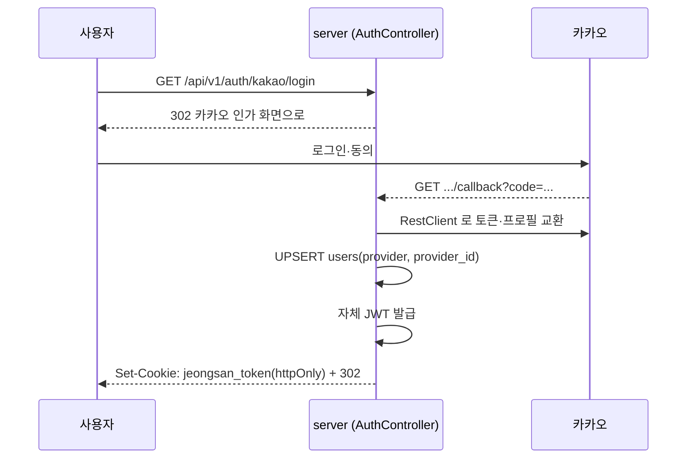

# 정산어택 — 아키텍처 개요

> **스냅샷 문서다.** 며칠이면 낡는다. 구체적인 스펙은 여기 다시 적지 않고
> 원본 문서로 링크한다 — 두 곳에 같은 내용을 적으면 반드시 한쪽이 낡는다.
> **작성일:** 2026-09-13

이 문서가 답하는 질문은 하나다 — **지금 이 시스템이 전체적으로 어떻게
생겼는가.** `REQUIREMENTS.md`가 "무엇을 만드는지", `ADR/*`가 "왜 그렇게
정했는지"를 담당한다면, 이 문서는 그 결정들이 실제로 어떤 모양으로
조립됐는지 한 곳에서 보여준다.

---

## 1. 컨텍스트·제약

**정산어택**은 술자리 정산 서비스다. 총무 혼자 참여자의 참석·음주 여부를
입력하지 않는다 — 참여자 각자 응답하고, 차수마다 결제자(총무)가 따로 있고,
수취인별로 송금액이 갈라진다. 제품 규칙의 단일 출처는
[`REQUIREMENTS.md`](REQUIREMENTS.md)다.

**움직이지 않는 제약**

- **1인 개발 + Codex 협업.** 코드는 대부분 Codex가 짜고, 사람(CTO)과
  Claude Code(시니어 리뷰어)가 PR을 검토한다 — [`AGENTS.md`](../AGENTS.md) §1.
- **포트폴리오 겸용.** 특정 회사에 한정하지 않고 백엔드 채용 전반에 지원
  자료로 쓴다. "측정으로 정당화한 결정"과 "트레이드오프를 인지하고 미룬 결정"을
  구분해 남기는 이유가 여기 있다 — ADR과 DEVLOG가 그 기록이다.
- **2~3개월 MVP 스프린트.** 원래 1개월이었으나 REQUIREMENTS.md v2로 범위가
  늘며(영수증·OCR·AI 보조 입력, 1:1 이의제기 채팅) 2~3개월로 늘렸다
  (`DEVLOG.md` 2026-09-13). 기간이 늘어도 구조는 지금 필요한 만큼만 올린다는
  원칙은 그대로다. MSA·k3s로 갔다가([ADR-013](ADR/013-msa-spring-cloud-k3s.md))
  "학습 목적"이었다는 걸 인정하고 모놀리스로 되돌린 전례가 있다
  ([ADR-014](ADR/014-monolith-first-feature-package.md)).
- **단일 VM 배포.** OCI 인스턴스 하나, docker compose,
  Kubernetes·ArgoCD·Jenkins 없음 ([ADR-006](ADR/006-single-vm-no-kubernetes.md)).

---

## 2. 해결 전략

### 2.1 순수 계산 / 부수효과 분리 (Functional Core, Imperative Shell)

`core` 모듈이 정산 계산의 **유일한** 구현이다. Spring·JPA·시간·랜덤 같은
부수효과가 전혀 없는 순수 Kotlin이고, `server`는 입력을 모아 `core`에
넘기고 결과를 응답할 뿐 재계산하지 않는다
([ADR-001](ADR/001-rational-not-bigdecimal.md),
[ADR-005](ADR/005-no-stored-settlement.md)).

이 경계를 지키는 이유는 측정된 사고 때문이다. `BigDecimal`이 정확히
표현하는 건 **10진 소수**지 **나눗셈**이 아니다 — `1/3`은 어떤 진법으로도
유한 자리로 못 쓰므로 나누는 순간 정보가 버려지고, 마지막 `ceil`은 그
찌꺼기가 아무리 작아도 무조건 1원을 통째로 올린다.

```
예: 20,000원을 3명이 나눔 (정확히 20,000원이 나와야 정상)
BigDecimal HALF_UP, 12자리 → 20000.000000000001원 → 20,010원 (틀림)
Rational (분자/분모 BigInteger)  → 정확히 20000/3 × 3 = 20,000원 (정확)
```

랜덤 30,000건 중 210건(0.70%)에서 실제로 이렇게 틀렸고, **총합 검증으로도
못 잡힌다** — 대표결제자가 오차를 흡수해 `합계 == 원금`은 그대로 통과하기
때문이다. `core`는 그래서 `Rational`로만 계산한다 — 나눗셈 자체를 하지
않고 분수 그대로 들고 다니다 맨 마지막 올림 시점 한 번만 정수 비교를
하므로 버릴 정보가 없다. 대안 검토(`ROUND_DOWN`을 채택하지 않은 이유
포함) 전체 유도는 [`ADR-001`](ADR/001-rational-not-bigdecimal.md).
`allWarningsAsErrors = true`라 경고 하나로도 빌드가 깨진다.

### 2.2 모놀리스 · feature 패키지

배포 단위는 하나(`server` 모듈)지만, 내부는 **layer가 아니라 feature로**
나눈다 — `server/user`, `server/group`, `server/gathering`, `server/common`,
`server/config`. `controller/`·`service/`·`repository/` 같은 최상위
레이어 패키지는 만들지 않는다([ADR-014](ADR/014-monolith-first-feature-package.md)).

### 2.3 스키마가 코드를 이끈다

`ddl-auto: none`이 고정이라, 스키마를 바꾸는 유일한 방법은 Liquibase
changelog다. 순서는 항상 **changelog 먼저, 엔티티가 그걸 따라간다.**
`ERD.md`는 changelog를 사람이 읽기 좋게 옮긴 요약일 뿐, 진실은 항상
`server/src/main/resources/db/changelog/`에 있다.

### 2.4 설계 문서 → 코드, 순서를 지킨다

새 기능은 요구사항만 보고 코드를 먼저 고치지 않는다. 지금 진행 중인
Core v1 → v2 전환이 그 순서를 그대로 보여준다
([`REQUIREMENTS.md`](REQUIREMENTS.md) §13,
[`DOMAIN_DB_DESIGN_V2.md`](DOMAIN_DB_DESIGN_V2.md) §8):

```
REQUIREMENTS.md (제품 규칙)
  → CALC_RULES_V2.md (계산 규칙 + 검증 케이스)
  → DOMAIN_DB_DESIGN_V2.md (애그리거트 · 상태 모델 · 논리 스키마)
  → 새 ADR (기존 결정과 충돌하는 지점을 명시적으로 대체)
  → Liquibase changelog (전역 연번 주의 — AGENTS.md §7)
  → ERD.md 갱신
  → core 테스트 먼저 (Kotest)
  → server 구현 + 성공/권한 실패 테스트
  → API.md 버전 상승
```

**기존 `core`/`server` 코드는 이 순서가 끝나기 전까지 현재 계약대로
유지한다** — 이 원칙 때문에 지금 저장소엔 "설계는 v2, 구현은 v1"인
과도기 지점이 여러 개 있다. §8에서 구체적으로 짚는다.

---

## 3. 빌딩 블록 뷰

```mermaid
flowchart TB
    subgraph client [클라이언트]
        Web[참여자 웹\nprofile 저장소]
        App[KMP 앱\njungsan_app 저장소]
    end

    subgraph server [server 모듈 — Spring Boot]
        Auth[user\n카카오 로그인 · JWT 쿠키]
        Group[group\n모임 · 멤버 · 차단]
        Gathering[gathering\n술자리 · 차수]
        Common[common\n@LoginUser · ApiException]
    end

    Core["core 모듈\n순수 Kotlin · Spring 의존성 없음\nSettlement.settle() 단일 진입점"]

    DB[(MySQL 8.4\nLiquibase changelog)]

    Web -->|httpOnly 쿠키| Auth
    App -->|"Bearer 헤더 (미도입)"| Auth
    Auth --> Common
    Group --> Common
    Gathering --> Common
    Gathering -->|계산 위임| Core
    Common --> DB
    Group --> DB
    Gathering --> DB
```

### `core` — 계산 엔진

순수 함수 하나가 전부다.

```kotlin
Settlement.settle(input: SettlementInput): SettlementOutcome
```

예외를 던지지 않는다 — 실패도 `SettlementOutcome.Failure`라는 반환값이다.
지금 구현(v1)은 **전역 대표결제자 + greedy 상계** 규칙
([`CALC_RULES.md`](CALC_RULES.md))이고, 설계가 끝난 v2는 **차수 총무별
수취인 분리, 상계 없음**으로 완전히 다른 계산 모델이다
([`CALC_RULES_V2.md`](CALC_RULES_V2.md)). v2 전환은 진행 중이며 §8 참고.

### `server` — HTTP·영속성 계층

컨트롤러는 실제로 3개뿐이다 — `AuthController`, `GroupController`,
`GatheringController`. 그 외 API.md에 계약만 있고 구현이 없는
엔드포인트가 많다. 인증은 **Spring Security 없이** `@LoginUser` 커스텀
파라미터 리졸버 하나로 처리한다 — 이 말은 **그 애너테이션을 안 붙인
핸들러는 기본값이 공개**라는 뜻이다(`AGENTS.md` §4-7의 경고가 이 함정
때문에 있다).

### DB — MySQL 8.4

`user_groups`(`groups`는 예약어라 리네임), `group_members`, `group_bans`,
`gatherings`, `participants`, `rounds`, `drink_items`, `attendances`,
`notification_outbox`까지가 현재 changelog(`001`~`014`)가 만든 테이블이다.
v2가 설계한 `settlements`/`settlement_transfers`/`disputes`/
`dispute_messages`/`notifications`는 아직 changelog로 안 들어갔다
(`DOMAIN_DB_DESIGN_V2.md` §4.2).

---

## 4. 런타임 뷰 — 핵심 흐름

**지금 실제로 돌아가는 흐름만 여기 둔다.** 아직 구현 안 된 v2 흐름(정산
확정 트랜잭션)은 §8에서 상태로만 짚고, 순서·규칙 자체는
[`DOMAIN_DB_DESIGN_V2.md`](DOMAIN_DB_DESIGN_V2.md) §5에만 적는다 — 두
문서에 같은 단계 목록을 유지하면 한쪽이 반드시 낡는다.

### 카카오 로그인



Spring Security의 OAuth2 Client 오토컨피그를 의도적으로 안 쓴다 — 세션
기반 흐름이 "완전 무상태" 방향과 안 맞아서다. `api.jungsan.devkdk.com`과
`jungsan.devkdk.com`이 같은 등록 도메인(`devkdk.com`)을 공유해
`SameSite=Lax`가 same-site로 동작한다는 전제가 깔려 있다.

---

## 5. 배포 뷰

```
GitHub push (main)
  → GitHub Actions (ubuntu-24.04-arm — OCI Ampere 와 아키텍처 일치)
  → Docker 이미지 빌드 → tar.gz → SCP
  → scripts/deploy/*.sh 실행 (배포 로직은 워크플로가 아니라 스크립트에 있다 —
    서버에서 같은 스크립트를 손으로 재현할 수 있어야 한다)
  → docker compose (OCI 단일 VM)
```

`application-prod.yml`엔 기본값이 하나도 없다 — 환경변수가 빠지면
부팅이 즉시 실패해야 한다(fail-fast). `docs/DEPLOY.md` 참고.

> **이 스냅샷 시점엔 실제 배포를 아직 안 했다.** 파이프라인은 로컬에서
> 각 단계(빌드·부팅·헬스체크 실패/성공)를 검증했지만, OCI에 실제로 쏜
> 적은 없다.

---

## 6. 횡단 관심사

| 관심사 | 규칙 | 근거 |
|---|---|---|
| 인증 | httpOnly JWT 쿠키(`jeongsan_token`)뿐. Bearer 헤더·localStorage 없음 | `AGENTS.md` §4-7 |
| 계산 | `core`만 계산, `server`는 재계산 안 함 | ADR-005, ADR-015 |
| 금액 정밀도 | `Rational`만, `BigDecimal` 금지 | ADR-001 |
| 스키마 변경 | changelog 먼저, 전역 연번(파일 번호 ≠ changeSet id) | `AGENTS.md` §5·§7 |
| 동시성 | 분산 락 대신 DB 유니크 제약 + 조건부 갱신 | `DOMAIN_DB_DESIGN_V2.md` §6 |
| N+1 | `IN :ids` + `GROUP BY` 배치 조회 | `GroupRepository.countByGroupIds` |
| 알림 | 메시지 브로커 대신 outbox 테이블, 비즈니스 트랜잭션과 분리 | ADR-002 |
| 참여자 웹 | 앱 설치 요구 안 함, 카카오톡 인앱 브라우저 대응 | ADR-003, ADR-007 |

---

## 7. 아키텍처 결정 — 지금 유효한 것만

전체 목록과 재검토 조건은 [`ADR/000-index.md`](ADR/000-index.md). 여기선
**지금 유효한 결정의 계보**만 짚는다 — 뒤집혔던 결정도 있어서, "지금 뭐가
맞는 건지" 헷갈리기 쉽다.

- **배포**: `006`(단일 VM) → `013`(MSA로 전환, 근거가 "학습 목적"이었음이
  드러남) → `014`(`006`을 되살리고 `013`을 보류). **지금은 `014`·`006`이
  유효하다.**
- **저장 정책**: `005`(계산 결과 미저장) → `015`(확정 시점 송금 스냅샷만
  예외적으로 저장). **`015`가 `005`를 완전히 대체하지 않고 좁힌다** —
  미리보기는 여전히 미저장, 확정 순간의 송금 명세만 불변 스냅샷.
- **채팅**: `010`(Netty+WebSocket+MongoDB, REST와 별도 프로세스) →
  `014`가 모놀리스로 합치며 보류. `DOMAIN_DB_DESIGN_V2.md`가 범위를
  "이의제기 당사자 1:1 텍스트 채팅"으로 좁혀 MySQL 안에서 부활시켰다 —
  `010`을 대체하는 새 ADR이 아직 없다(§8 참고).

---

## 8. 진행 중인 전환 · 리스크

**Core v1 → v2.** 설계(`CALC_RULES_V2.md`, `DOMAIN_DB_DESIGN_V2.md`)는
확정됐고, 모임 관리 기반(changelog `012`~`014`: 관리자·비밀번호·구성원
상태·차단)은 구현·검증까지 끝났다. **술자리·차수·응답·정산 확정은 아직
v1 계약 그대로다.** `core`의 `Settlement`/`Validation`/`Model`이 지금
이 시점에 활발히 수정되고 있다면, 그건 v2 전환 작업 중이라는 뜻이다 —
병합 전에 `CALC_RULES_V2.md` §8 체크리스트와 대조해라.

정산 확정 트랜잭션의 순서·동시성 규칙 자체는 이미 확정 설계다 — **설계가
아니라 구현만 남았다.** 순서는 `DOMAIN_DB_DESIGN_V2.md` §5, 동시성 규칙은
같은 문서 §6에 있다(§6 횡단 관심사 표에도 링크).

**v2가 아직 새 ADR로 안 남은 결정 3개.** `DOMAIN_DB_DESIGN_V2.md` §7이
직접 지목한다 — 조용히 덮어쓰지 말라는 경고다.

- `ADR-004`(2단계 확정) — 유지되지만 "재확정" 관련 서술은 폐기 대상
- `ADR-008`(정원 잠금·PENDING) — 정원 요구 자체가 사라져 단순화 필요
- `ADR-010`(실시간 채팅 보류) — 위에서 설명한 대로 범위를 좁혀 부활하는
  중인데 그 결정이 아직 문서화 안 됨

**인증 확장.** 지금 규칙(httpOnly 쿠키뿐)은 웹 전용 전제다. KMP
앱(`jungsan_app` 저장소)이 붙으면 앱은 쿠키를 못 쓰니 Authorization
헤더 경로가 필요해진다 — "웹은 쿠키, 앱은 헤더" 이원화는 아직 설계도
구현도 안 됐다. `AGENTS.md` §4-7을 그대로 둔 채 앱을 붙이면 그 규칙이
가로막는다.

**폐기 후보 컬럼·테이블.** `participants`의 `exempt`/`responded*`/
`payment_status`/`paid_amount`, `gatherings`의 `expected_count`/
`rounding_unit`, `extra_items`/`extra_item_bearers` 전체 — v2 전환
migration에서 정리 대상이다(`DOMAIN_DB_DESIGN_V2.md` §4.1). 지금 이
컬럼에 의존하는 코드를 새로 짜지 마라.

---

## 9. 다음 사람(또는 다음 PR)이 알아야 할 것

- 이 문서가 낡았다고 느껴지면 §8부터 의심해라 — 가장 빨리 낡는 절이다.
- 새 아키텍처 결정을 내렸다면 여기 말고 **ADR을 먼저** 써라. 이 문서는
  ADR을 요약해 보여줄 뿐, 결정이 내려지는 곳이 아니다.
- 코드리뷰 기준으로 이 문서를 쓴다면: PR이 §2의 전략(functional
  core/imperative shell, feature 패키지, schema-first)에서 벗어나거나,
  §8에 적힌 "아직 v1"인 지점을 v2 방식으로 몰래 바꾸는지를 먼저 본다.
