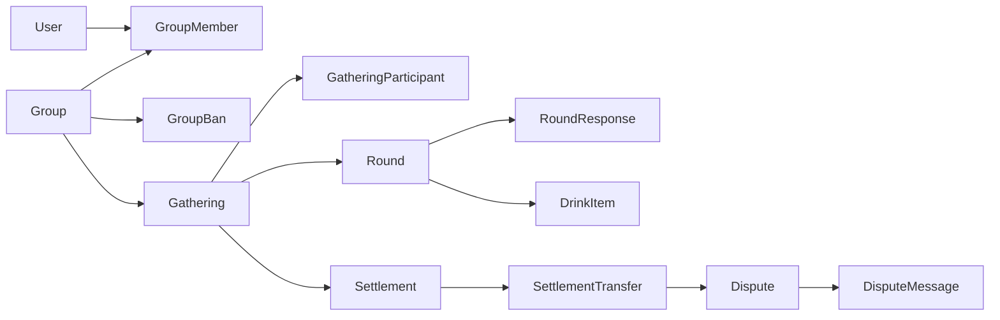

# 정산어택 — 도메인·DB 설계 v2

> **상태:** Core v2 반영 설계 확정 · 모임 관리 기반(`012`~`014`) 구현 완료  
> **작성일:** 2026-09-03  
> **제품 기준:** `REQUIREMENTS.md`  
> **계산 기준:** `CALC_RULES_V2.md`

이 문서는 요구사항과 Core v2를 서버 도메인 및 MySQL 스키마로 옮기기 위한
구현 계약이다. 현재 스키마는 `001`~`011` changelog와 `ERD.md`가 나타내며,
아래 내용 중 모임 관리자·가입 비밀번호·구성원 생명주기·차단은 `012`~`014`에
반영했다. 술자리 계산 입력과 확정 송금 스냅샷은 후속 additive migration 대상이다.

---

## 1. 설계 결론

1. `Group`은 지속적인 소속 공간이고 `Gathering`은 한 날짜의 정산 단위다.
2. 모임 관리자는 `user_groups.admin_user_id`로 한 명만 직접 가리킨다.
3. 술자리 생성자는 운영 권한을 가지지만 돈을 받는 사람은 아니다.
4. 각 `Round`의 `manager_participant_id`가 유일한 결제자이자 수취인이다.
5. 면제는 참여자 전체가 아니라 `RoundResponse`의 차수별 상태다.
6. 미리보기는 저장하지 않고 Core에서 매번 계산한다.
7. 금액 확정 순간에는 Core 결과의 송금 명세를 불변 스냅샷으로 저장한다.
8. 입금 및 이의제기는 스냅샷의 개별 송금 건을 기준으로 진행한다.
9. 금액 확정 후 기존 계산 입력은 수정하지 않는다.
10. 중복 참여는 분산 락이 아니라 DB 유니크 제약과 조건부 갱신으로 막는다.

---

## 2. 애그리거트와 소유권



| 애그리거트 | 책임 | 주요 불변식 |
|---|---|---|
| `Group` | 관리자, 구성원, 가입, 차단, 보관 | 관리자는 정확히 한 명이며 활성 구성원이다 |
| `Gathering` | 생성자, 참여 명단, 차수, 전체 진행 상태 | 생성자는 참여자이고 금액 확정 후 입력 불변 |
| `Round` | 비용, 술 항목, 총무, 차수 확정 | 총무는 해당 술자리의 활성 참여자이며 차수당 한 명 |
| `Settlement` | 확정된 계산 버전과 송금 스냅샷 | 술자리당 MVP 정산 한 건, 확정 이후 금액 불변 |
| `SettlementTransfer` | 송금 요청·수취 확인 | 송금자와 수취인이 다르고 금액은 양수 |
| `Dispute` | 특정 송금의 당사자 조율 | 한 송금에 열린 이의제기는 최대 한 건 |

`Settlement`는 별도의 계산 엔진이 아니다. 계산은 계속 `core`만 수행하고 서버는
확정 시점의 결과와 워크플로 상태만 보존한다.

---

## 3. 상태 모델

### 3.1 술자리

```text
ROSTER_OPEN → RESPONDING → ROUND_CONFIRMING → AMOUNT_CONFIRMED
                                             → PAYMENT_IN_PROGRESS
                                             → COMPLETED
```

- `ROSTER_OPEN`: 참여 가능, 차수·총무·비용 수정 가능
- `RESPONDING`: 명단 마감, 참여 불가, 응답 수집 중
- `ROUND_CONFIRMING`: 응답 완료 후 차수별 총무가 검토·확정
- `AMOUNT_CONFIRMED`: 입력 잠금과 송금 스냅샷 생성이 끝난 순간
- `PAYMENT_IN_PROGRESS`: 송금 확인 및 이의 조율 중
- `COMPLETED`: 모든 송금 확인 완료, 열린 이의제기 없음

명단 재개는 `RESPONDING` 또는 `ROUND_CONFIRMING`에서 `ROSTER_OPEN`으로만 가능하다.
`AMOUNT_CONFIRMED` 이후에는 역방향 전이가 없다.

### 3.2 차수와 응답

- 차수: `DRAFT → CONFIRMED`, 전체 금액 확정 전에는 `DRAFT`로 되돌릴 수 있다.
- 응답: `ABSENT | EXEMPT | SOBER | DRANK` 중 정확히 하나다.
- 응답 행의 존재 자체가 응답 완료를 뜻한다. 별도 `responded` 불리언을 두지 않는다.
- 모든 활성 참여자에게 모든 차수 응답이 있어야 그 차수를 확정할 수 있다.

### 3.3 송금

```text
WAITING → CONFIRMATION_REQUESTED → CONFIRMED
                                  → DISPUTED → WAITING
```

- `WAITING`: 아직 확인 요청 전이거나 이의 조율 후 재송금 대기
- `CONFIRMATION_REQUESTED`: 송금자가 입금 확인을 요청함
- `CONFIRMED`: 수취인이 실제 입금을 확인함
- `DISPUTED`: 금액 불일치 또는 미입금을 조율 중
- 수취인이 실수로 확인했다면 `CONFIRMED → WAITING` 복구를 허용하고 이력을 남긴다.

---

## 4. 논리 스키마

### 4.1 기존 테이블에서 유지·변경할 항목

#### `users`

로그인 식별자는 유지한다. 계정 탈퇴는 행 삭제 대신 개인정보 익명화와
`withdrawn_at` 기록으로 처리해 정산 FK와 표시 이력을 보존한다.

#### `user_groups`

| 컬럼 | 결정 |
|---|---|
| `created_by_user_id` | 생성 이력으로 유지, 관리자 권한 판단에 사용하지 않음 |
| `admin_user_id` | 추가, 현재 유일한 관리자 |
| `password_hash` | 추가, 평문·복호화 가능한 값 금지 |
| `share_token` | 가입 링크용으로 유지 |
| `deleted_at` | 의미를 `archived_at`으로 정리. 물리 삭제가 아님 |
| `group_type`, `delete_scheduled_at` | 새 요구사항에서는 폐기 후보. 자동 삭제 정책을 사용하지 않음 |

관리자 이전은 다음을 한 트랜잭션에서 처리한다.

1. 대상이 활성 `group_members`인지 확인한다.
2. `user_groups.admin_user_id`를 조건부 갱신한다.
3. 감사 이벤트를 기록한다.

기존 `group_members.role = OWNER`는 이중 진실을 만들므로 v2에서는 권한 판정에 쓰지
않고 제거 대상으로 둔다.

#### `group_members`

`(group_id, user_id)` 유니크는 유지한다. 재가입과 이력을 함께 표현하려고 행을
삭제하지 않고 `status = ACTIVE | LEFT | KICKED`, `left_at`을 둔다.

#### `gatherings`

| 기존 컬럼 | v2 의미 |
|---|---|
| `host_user_id` | `creator_user_id`로 이름과 의미를 정리 |
| `host_participant_id` | 제거 후보. 생성자는 `(gathering_id, user_id)`로 찾음 |
| `status` | v2 술자리 상태로 확장 |
| `expected_count` | 정원 요구가 없어 제거 후보 |
| `rounding_unit` | Core v2가 1원 올림으로 고정하므로 제거 |
| `revision` | 입력 버전으로 유지 |
| `confirmed_at` | `amount_confirmed_at` 의미로 변경 |

`input_revision`은 차수·응답·술 항목·총무 등 계산 입력이 바뀔 때 증가한다.
미리보기 응답은 `inputHash`와 `inputRevision`을 반환하고 금액 확정 요청이 둘 다
일치할 때만 성공한다.

#### `participants`

테이블의 도메인명은 `GatheringParticipant`다.

| 항목 | 결정 |
|---|---|
| `(gathering_id, user_id)` | 유지, 중복 참여의 최종 방어선 |
| `participant_type` | `MEMBER | GUEST` 추가 |
| `status` | `ACTIVE | REMOVED`로 정리 |
| `exempt`, `responded*` | 제거. `round_responses`가 담당 |
| `payment_status`, `paid_amount`, 입금 시각 | 제거. `settlement_transfers`가 담당 |
| 지급 계좌 | 참여자에 유지 가능하나 암호화·마스킹 정책을 별도 확정 |

외부 참여자도 `user_id NOT NULL`이며 카카오 로그인 사용자다. 제거된 외부 참여자가
같은 술자리에 다시 들어오는 것은 기존 행의 `REMOVED` 상태로 차단한다.

#### `rounds`

- `payer_id`는 `manager_participant_id`로 이름을 정리한다.
- `status`, `confirmed_at`, `confirmed_by_user_id`를 추가한다.
- `(gathering_id, seq)` 유니크는 유지한다.
- 삭제된 `seq`는 재사용하지 않고 `MAX(seq) + 1`을 부여한다.
- 금액 확정 전 삭제는 soft delete로 처리해 순번과 변경 이력을 보존한다.

#### `attendances`

도메인명과 물리 테이블명을 `RoundResponse` / `round_responses`로 정리한다.
`attended`, `drank` 조합 대신 `response_type` 하나를 저장한다.

```text
PRIMARY KEY (participant_id, round_id)
response_type = ABSENT | EXEMPT | SOBER | DRANK
submitted_at, updated_at
```

`extra_items`, `extra_item_bearers`는 v2 코드에서 읽거나 쓰지 않는다. MVP 데이터가
없음을 검증한 뒤 별도 migration에서 제거한다.

### 4.2 새 테이블

#### `group_bans`

```text
group_id, user_id                 PK
banned_by_user_id
banned_at
released_by_user_id              NULL 가능
released_at                      NULL 가능
```

현재 차단 여부는 `released_at IS NULL`이다. 과거 강퇴 기록을 덮어쓰지 않아야 한다면
추후 surrogate key와 이력 행 방식으로 확장한다. MVP에서는 사용자당 현재 차단 한 건이면
충분하다.

#### `settlements`

```text
id                               PK
gathering_id                     UNIQUE
status                           CONFIRMED | PAYMENT_IN_PROGRESS | COMPLETED
input_revision
input_hash                       CHAR(64)
grand_total
confirmed_by_user_id
confirmed_at
completed_at                     NULL 가능
```

MVP는 확정 후 재정산을 지원하지 않으므로 `gathering_id`가 유일하다.

#### `settlement_transfers`

```text
id                               PK
settlement_id                    FK
sender_participant_id            FK
recipient_participant_id         FK
amount                           BIGINT
status                           WAITING | CONFIRMATION_REQUESTED | DISPUTED | CONFIRMED
confirmation_requested_at        NULL 가능
confirmed_at                     NULL 가능
updated_at

UNIQUE (settlement_id, sender_participant_id, recipient_participant_id)
CHECK 개념: sender != recipient, amount > 0
```

이 테이블은 Core v2 `Transfer`의 확정 스냅샷이다. 수취인별 원금 검증과 화면 근거를
위해 `settlement_recipient_summaries`를 별도 저장하지 않고, 확정 시 Core 결과와
transfer 합계를 검증한 후 저장한다. 상세 계산 근거는 고정된 입력으로 Core를 다시
실행해 표시할 수 있다.

#### `payment_status_histories`

```text
id, transfer_id, from_status, to_status, changed_by_user_id, reason, created_at
```

확인 완료를 실수로 되돌린 경우까지 설명하기 위한 append-only 감사 기록이다.

#### `disputes`

```text
id                               PK
transfer_id                      FK
opened_by_user_id
status                           OPEN | COMPLETION_REQUESTED | RESOLVED
completion_requested_by_user_id  NULL 가능
completion_requested_at          NULL 가능
resolved_by_user_id              NULL 가능
resolved_at                      NULL 가능
resolution_type                  AGREED | OFFLINE
created_at
```

`COMPLETION_REQUESTED`는 한쪽의 협상 완료 제안이며 상대방 확인 전에는 합의가 아니다.
오프라인 조율 완료도 최소한 수취인이 실행하도록 권한을 제한한다. 24시간·48시간은
상태가 아니라 `created_at`/마지막 메시지 시각으로 계산해 알림 이벤트를 만든다.
자동 합의는 하지 않는다.

#### `dispute_messages`

```text
id, dispute_id, sender_user_id, message, created_at
```

MVP에서는 MySQL에 저장한다. 이미지·파일은 범위 밖이며 텍스트 메시지만 지원한다.
WebSocket은 전달 방식일 뿐, 메시지 저장의 진실은 이 테이블이다.

#### `notifications`

사용자가 앱 안에서 보는 알림을 저장한다. 기존 `notification_outbox`는 외부 푸시를
재시도하기 위한 전달 큐이므로 역할이 다르다.

```text
id, user_id, type, reference_type, reference_id, title, body,
read_at, created_at
```

내부 알림과 outbox 삽입은 도메인 상태 변경과 같은 트랜잭션에서 처리한다.

---

## 5. 확정 트랜잭션

금액 확정은 다음 순서를 하나의 DB 트랜잭션으로 수행한다.

1. `gatherings` 행을 읽고 아직 확정 전인지 확인한다.
2. 요청의 `inputRevision`과 `inputHash`를 현재 입력과 비교한다.
3. 모든 차수 확정, 모든 활성 참여자의 응답 존재를 검증한다.
4. 같은 입력으로 Core v2를 다시 실행한다.
5. `settlements` 한 건과 `settlement_transfers`를 삽입한다.
6. 술자리 상태를 `AMOUNT_CONFIRMED`로 조건부 갱신한다.
7. 내부 알림과 푸시 outbox를 삽입한다.
8. 커밋한다.

두 확정 요청이 동시에 오면 `UNIQUE(settlements.gathering_id)`와 조건부 상태 갱신 중
하나만 성공한다. 분산 락은 필요 없다.

---

## 6. 동시성 규칙

| 경합 | 방어 수단 |
|---|---|
| 참가 버튼 중복·재요청 | `UNIQUE(gathering_id, user_id)`와 멱등 응답 |
| 차단 사용자 가입 | 가입 트랜잭션에서 활성 `group_bans` 확인 |
| 명단 마감과 참가 동시 실행 | `gatherings` 상태 조건부 갱신 및 동일 행 잠금 순서 |
| 응답 수정과 차수 확정 | 차수 상태 조건부 쓰기 + 입력 revision 증가 |
| 미리보기와 금액 확정 사이 변경 | `inputHash` + `inputRevision` 불일치 시 409 |
| 금액 확정 더블클릭 | 술자리 상태 조건 + settlement 유니크 |
| 입금 확인 요청 더블클릭 | 현재 상태를 조건으로 한 update, 동일 상태면 멱등 성공 |
| 이의제기 중복 생성 | 송금별 열린 분쟁 유니크 정책과 트랜잭션 검사 |

모든 잠금 경로는 `user_groups → gatherings → rounds/participants` 순서를 지킨다.
트랜잭션 안에서 카카오·FCM 같은 외부 호출을 하지 않는다.

---

## 7. 기존 결정과의 충돌

| 기존 결정 | v2 판단 |
|---|---|
| ADR-004 `inputHash` 2단계 확정 | 유지. 단, 재확정 설명은 폐기 |
| ADR-005 계산 결과 미저장 | 개정 필요. preview는 미저장, 확정 transfer는 증거로 저장 |
| ADR-008 정원 잠금·PENDING | 정원 요구 삭제에 따라 단순화. 중복 참여 유니크는 유지 |
| ADR-009 지속 모임 | 유지하되 검색·비밀번호·차단·보관 추가 |
| ADR-010 일반 모임 채팅 | 분쟁 1:1 텍스트 채팅으로 MVP 범위 축소, MySQL 유지 |
| ADR-014 모놀리스·feature package | 유지 |

ADR 문서를 조용히 덮어쓰지 않는다. migration 전에 ADR-004·005·008·010의
후속 결정을 새 ADR로 기록하거나 각 문서에 superseded 표기를 추가한다.

---

## 8. 구현 순서

1. v2 스냅샷·상태·채팅 저장 결정을 ADR로 확정한다.
2. `012-group-management-foundation.yaml`과 MySQL 컬럼 정의 보정용 `013`~`014`를 작성한다.
3. MySQL 8.4에서 기존 `001`~`011` 업그레이드와 빈 DB 전체 migration을 검증한다.
4. `ERD.md`와 테이블 명세를 실제 changelog에 맞춰 갱신한다.
5. 서버 entity/repository를 v2 도메인으로 전환한다.
6. 그룹 관리 → 술자리/차수/응답 → 확정 → 입금 → 분쟁 순서로 API를 구현한다.
7. 각 상태 전이·권한·동시성 테스트를 추가한다.

---

## 9. 구현 전 확인 체크리스트

- [x] 생성자와 돈을 받는 차수 총무를 분리했다.
- [x] 차수별 면제를 응답 상태로 표현했다.
- [x] 여러 수취인에게 보내는 송금을 참가자 전역 상태에서 분리했다.
- [x] 확정 후 불변 금액을 추적할 스냅샷을 정의했다.
- [x] 내부 알림과 푸시 outbox의 책임을 분리했다.
- [x] 외부 참여자도 로그인 사용자이며 중복 참여가 불가능하다.
- [x] 기타 항목과 자동 재정산을 MVP에서 제외했다.
- [ ] 계좌번호 저장 시 암호화·조회 권한·로그 마스킹을 보안 설계에서 확정한다.
- [ ] 실제 migration에서 폐기 컬럼의 기존 데이터 존재 여부를 검증한다.

### 구현 진행

- [x] `012` / changeSet `018`~`020`: 관리자·비밀번호·구성원 상태·모임 차단
- [x] `013` / changeSet `021`: MySQL `addNotNullConstraint`가 지운 관리자 컬럼 주석 복구
- [x] `014` / changeSet `022`: `admin_user_id`의 `NOT NULL`과 주석을 함께 고정
- [ ] 술자리·참여자·차수·응답 v2 전환
- [ ] 확정 송금 스냅샷·입금 상태 이력
