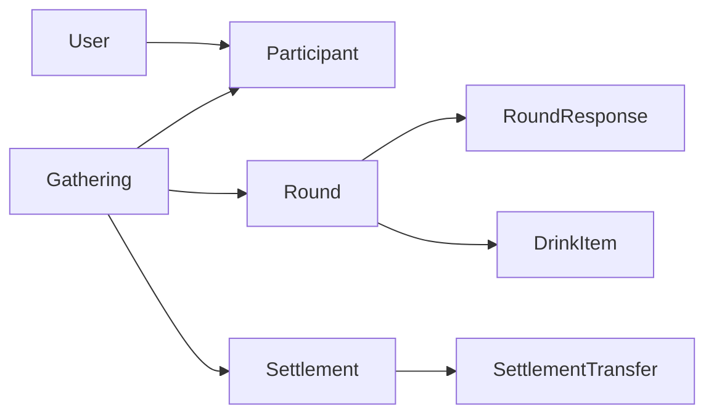

# 정산어택 — 도메인·DB 설계 (Core v2 · 제품 v3)

> **상태:** 제품 v3(일회용 술자리) 기준 설계 확정 · 구현 전
> **작성일:** 2026-09-03 · **개정:** 2026-09-29 (v3 단순화, `ADR-019`)
> **제품 기준:** `REQUIREMENTS.md` v3
> **계산 기준:** `CALC_RULES_V2.md` (v3에서 변경 없음)

이 문서는 요구사항과 Core v2를 서버 도메인 및 MySQL 스키마로 옮기기 위한
구현 계약이다. 파일명의 `V2`는 **계산 엔진(Core) v2**를 뜻한다 — 제품 요구사항은 v3다.

> [!IMPORTANT]
> **2026-09-29 개정.** 이전판은 모임(`Group`)·모임 차단·차수 총무의 차수 확정·
> 1:1 이의제기 채팅을 전제했다. 제품 v3에서 전부 제거됐다(`ADR-019`).
> 이전판이 "구현 완료"로 적었던 모임 관리 기반 changelog `012`~`014`
> (changeSet `018`~`022`)는 **`main`에 병합된 적이 없으며 v3에서 쓰지 않는다.**
> 그 changeSet id는 로컬 DB에 적용됐을 수 있으므로 **재사용하지 않는다** — §8 참조.

---

## 1. 설계 결론

1. **술자리(`Gathering`)가 최상위 애그리거트다.** 모임 계층은 없다.
2. 술자리는 **일회용**이다. 완료 7일 뒤, 또는 30일간 활동이 없으면 물리 삭제한다.
3. 총무(`host`)는 술자리당 한 명이며 참여자이기도 하다.
4. 각 `Round`의 `payer_participant_id`가 그 차수의 유일한 결제자이자 수취인이다.
   결제자에게는 확정 의무가 없다 — **데이터일 뿐 역할이 아니다.**
5. 면제는 차수별 응답 상태(`EXEMPT`)이며 **총무만** 설정한다.
6. 미응답 칸은 정산 시점에 자동응답(`DRANK`, 출처 `AUTO`)으로 채운다.
7. 미리보기는 저장하지 않고 Core에서 매번 계산한다.
8. 정산하기 순간 Core 결과의 송금 명세를 스냅샷으로 저장한다(`ADR-015`).
   스냅샷은 수정하지 않는다 — 되돌리기는 스냅샷을 **통째로 폐기**하는 것이다.
9. 중복 참여·중복 요청은 분산 락이 아니라 DB 유니크 제약과 조건부 갱신으로 막는다.

---

## 2. 애그리거트와 소유권


```mermaid
flowchart LR
    U[User] --> P[Participant]
    GA[Gathering] --> P
    GA --> R[Round]
    R --> RR[RoundResponse]
    R --> DI[DrinkItem]
    GA --> S[Settlement]
    S --> T[SettlementTransfer]
```

| 애그리거트 | 책임 | 주요 불변식 |
|---|---|---|
| `User` | 로그인, 표시 이름, 받을 계좌 | 계좌는 사용자당 하나, 재사용 |
| `Gathering` | 총무, 참여자 명단, 차수, 진행 상태, 수명 | 총무는 참여자. 정산 후 입력 불변 |
| `Round` | 금액, 술 항목, 결제자 | 결제자는 활성 참여자이며 차수당 한 명 |
| `Settlement` | 정산 시점 입력 버전과 송금 스냅샷 | 술자리당 최대 한 건 |
| `SettlementTransfer` | 송금·수취 확인 | 송금자 ≠ 수취인, 금액 > 0 |

`Settlement`는 별도의 계산 엔진이 아니다. 계산은 `core`만 수행하고 서버는 정산 시점
결과와 송금 진행 상태만 보존한다.

---

## 3. 상태 모델

### 3.1 술자리

```text
OPEN ──정산하기──▶ SETTLING ──모든 송금 확인 / 정산 끝내기──▶ COMPLETED ──7일──▶ (삭제)
  ▲                   │
  └──정산 되돌리기──────┘   (모든 송금의 sent_at·confirmed_at이 한 번도 채워지지 않았을 때만)
```

| 상태 | 참여 | 응답 수정 | 총무 입력 수정 | 송금 |
|---|---|---|---|---|
| `OPEN` | 가능 | 가능 | 가능 | 없음 |
| `SETTLING` | 불가 | 불가 | 불가 | 진행 |
| `COMPLETED` | 불가 | 불가 | 불가 | 조회만 |

- 이전판의 `ROSTER_OPEN`·`RESPONDING`·`ROUND_CONFIRMING`·`AMOUNT_CONFIRMED`·
  `PAYMENT_IN_PROGRESS`는 없다.
- 정산하기 결과 송금이 0건이면(예: 결제자 혼자뿐) 바로 `COMPLETED`로 간다.

### 3.2 차수 응답

- `response_type = ABSENT | SOBER | DRANK | EXEMPT`
- `source = SELF | AUTO | HOST`
  - 참여자는 `SELF`로 `ABSENT`·`SOBER`·`DRANK`만 쓴다.
  - 총무는 `HOST`로 `EXEMPT`를 쓰고 해제할 수 있다. `HOST`가 쓴 칸은 참여자가 바꿀 수 없다.
  - 정산하기 트랜잭션이 빈 칸을 `AUTO`·`DRANK`로 채운다.
- 차수에 별도 상태(`DRAFT`/`CONFIRMED`)를 두지 않는다. 차수 확정 단계가 없다.

### 3.3 송금

```text
WAITING ──보냈어요──▶ SENT ──확인──▶ CONFIRMED
   ▲                  │
   └──아직 안 들어왔어요─┘
WAITING ──수취인 직접 확인──▶ CONFIRMED
CONFIRMED ──수취인 확인 취소──▶ WAITING   (술자리가 SETTLING일 때만)
```

- 이전판의 `CONFIRMATION_REQUESTED`·`DISPUTED`와 이의제기 흐름은 없다.
- `not_received_at`에 마지막 [아직 안 들어왔어요] 시각을 남겨 송금자 화면에 표시한다.

---

## 4. 논리 스키마

### 4.1 기존 테이블에서 유지·변경·폐기할 항목

#### `users`

| 항목 | 결정 |
|---|---|
| 로그인 식별자 | 유지 |
| `display_name` | 추가. 카카오 닉네임 기본값, 사용자가 한 번 확인·수정 |
| 받을 계좌 | `payout_bank`, `payout_account_no`, `payout_holder` 추가. 암호화·마스킹은 §9 |
| 탈퇴 | 개인정보 삭제. 술자리가 일회용이라 정산 FK 보존용 익명화는 필요 없다 — 탈퇴 전 진행 중 술자리 처리는 §9 미결 |

#### `user_groups`, `group_members` — **폐기**

v3에 모임이 없다. 새 changelog에서 `gatherings.group_id` FK를 먼저 제거한 뒤 두 테이블을
삭제한다. 이미 적용된 `002`·`009`·`011` changelog는 **수정하지 않는다**(checksum).

#### `gatherings`

| 기존 컬럼 | v3 결정 |
|---|---|
| `group_id` | **폐기** |
| `host_user_id` | 유지. 총무 |
| `host_participant_id` | 폐기 후보. 총무의 참여자 행은 `(gathering_id, host_user_id)`로 찾는다 |
| `status` | `OPEN | SETTLING | COMPLETED` |
| `title` | 유지(없으면 추가). 생성 시 `M/d 술자리`로 자동 채움 |
| `share_token` | 유지. 참여 링크 |
| `expected_count` | **폐기** (정원·예상 인원 개념 없음) |
| `rounding_unit` | **폐기** (Core v2가 1원 올림 고정) |
| `revision` | `input_revision`으로 유지 |
| `settled_at`, `completed_at` | 추가 |
| `last_activity_at` | 추가. 30일 방치 삭제 판단용. 참여·응답·입력·송금 상태 변경 때 갱신 |
| `group_type`, `delete_scheduled_at`, `deleted_at` | **폐기** (모임 시절 컬럼) |

`input_revision`은 차수·금액·술 항목·결제자·응답·면제가 바뀔 때 증가한다.
미리보기는 `inputHash`와 `inputRevision`을 돌려주고, 정산하기 요청은 둘 다 일치할 때만
성공한다(`ADR-004`).

#### `participants`

| 항목 | 결정 |
|---|---|
| `(gathering_id, user_id)` | 유지. 중복 참여의 최종 방어선 |
| `status` | `ACTIVE | REMOVED` |
| `name` | 폐기 후보. 표시 이름은 `users.display_name`을 쓴다 |
| `exempt`, `responded*` | **폐기** — `round_responses`가 담당 |
| `payment_status`, `paid_amount`, 입금 시각 | **폐기** — `settlement_transfers`가 담당 |
| 계좌 컬럼 | **폐기** — `users`로 이동 |

`participant_type(MEMBER | GUEST)`는 도입하지 않는다 — 모임이 없으니 구분할 대상이 없다.

#### `rounds`

- `payer_id` → `payer_participant_id`. 기본값은 총무의 참여자 행.
- `(gathering_id, seq)` 유니크 유지. 삭제된 `seq`는 재사용하지 않고 `MAX(seq)+1`.
- 차수 상태(`status`, `confirmed_at`, `confirmed_by_user_id`)는 **추가하지 않는다.**

#### `attendances` → `round_responses`

```text
PRIMARY KEY (participant_id, round_id)
response_type  ABSENT | SOBER | DRANK | EXEMPT
source         SELF | AUTO | HOST
updated_at
```

`attended`·`drank` 조합 대신 `response_type` 하나로 저장한다. 행의 존재 자체가 응답이다.

#### `drink_items`

유지. `round_id`, `name`, `unit_price`, `quantity`.

#### `extra_items`, `extra_item_bearers` — **폐기**

기타 항목은 후속 기능이다. MVP 데이터가 없음을 확인한 뒤 새 changelog에서 삭제한다.

### 4.2 새 테이블

#### `settlements`

```text
id                     PK
gathering_id           UNIQUE, FK ON DELETE CASCADE
input_revision
input_hash             CHAR(64)
grand_total
settled_by_user_id
settled_at
```

상태는 `gatherings.status`가 가진다. 정산 되돌리기는 이 행과 송금 행을 삭제한다.

#### `settlement_transfers`

```text
id                         PK
settlement_id              FK ON DELETE CASCADE
sender_participant_id      FK
recipient_participant_id   FK
amount                     BIGINT
status                     WAITING | SENT | CONFIRMED
sent_at                    NULL 가능   — 한 번이라도 [보냈어요]가 눌린 적 있으면 채워짐
confirmed_at               NULL 가능
not_received_at            NULL 가능   — 마지막 [아직 안 들어왔어요]
updated_at

UNIQUE (settlement_id, sender_participant_id, recipient_participant_id)
개념 CHECK: sender != recipient, amount > 0
```

**`sent_at`과 `confirmed_at`은 상태가 되돌아가도 지우지 않는다.** 정산 되돌리기 가능
여부("돈이 움직이기 시작했는가")를 이 두 컬럼으로 판단하기 때문이다.

#### `notifications`

```text
id, user_id, type, gathering_id NULL 가능 (FK ON DELETE CASCADE),
title, body, read_at, created_at
```

외부 푸시 재시도는 기존 `notification_outbox`가 맡는다. 내부 알림과 outbox 삽입은
도메인 상태 변경과 같은 트랜잭션에서 처리한다.

### 4.3 만들지 않는 테이블

이전판에 있던 `group_bans`, `payment_status_histories`, `disputes`, `dispute_messages`는
**만들지 않는다.** 모임·이의제기 절차가 없고, 송금 상태 이력은 7일이면 사라지는 데이터라
감사 테이블을 둘 이유가 없다.

---

## 5. 핵심 트랜잭션

### 5.1 정산하기

하나의 DB 트랜잭션으로 수행한다.

1. `gatherings` 행을 읽고 `OPEN`인지 확인한다.
2. 요청의 `inputRevision`·`inputHash`를 현재 입력과 비교한다. 다르면 409.
   **해시는 자동응답이 채워질 값까지 포함해 계산한다** — 총무가 확인 화면에서 본 금액과
   서버가 고정하는 금액이 같아야 하기 때문이다.
3. 빈 (참여자, 차수) 칸에 `round_responses(DRANK, AUTO)`를 삽입한다.
4. 같은 입력으로 Core v2를 실행한다. `Failure`면 409와 오류 목록.
5. `settlements` 한 건과 `settlement_transfers`를 삽입한다.
6. 송금이 0건이면 `COMPLETED`, 아니면 `SETTLING`으로 조건부 갱신한다.
7. 내부 알림·outbox를 삽입한다 — 전원(금액 공개), 자동응답 대상자와 총무(자동응답),
   계좌 없는 결제자(계좌 등록 필요).
8. 커밋한다.

### 5.2 정산 되돌리기

1. 술자리가 `SETTLING`인지 확인한다.
2. 모든 송금의 `sent_at IS NULL AND confirmed_at IS NULL`인지 확인한다. 하나라도 아니면 409.
3. `source = AUTO`인 응답을 삭제한다(자동응답은 되돌리면 다시 빈 칸이 된다).
4. `settlements` 행을 삭제한다(송금은 CASCADE).
5. 술자리를 `OPEN`으로 조건부 갱신하고 `input_revision`을 올린다.
6. 전원에게 알림.

### 5.3 삭제 배치

`server`의 `@Scheduled` 작업이다. `core`에는 넣지 않는다(시간 의존).

```sql
-- 완료 7일 경과
DELETE FROM gatherings WHERE status = 'COMPLETED' AND completed_at < NOW() - INTERVAL 7 DAY;
-- 30일 방치
DELETE FROM gatherings WHERE status <> 'COMPLETED' AND last_activity_at < NOW() - INTERVAL 30 DAY;
```

- 자식 테이블은 FK `ON DELETE CASCADE`로 함께 지운다.
- 한 번에 많이 지우지 않도록 `LIMIT`으로 나눠 반복한다.
- 멱등하다 — 같은 배치가 두 번 돌아도 결과가 같다.
- 시각 비교는 UTC 기준이다(`AGENTS.md`·스키마 규율).

---

## 6. 동시성 규칙

| 경합 | 방어 수단 |
|---|---|
| 참가 버튼 중복·재요청 | `UNIQUE(gathering_id, user_id)`와 멱등 응답 |
| 정산하기와 참가 동시 실행 | `gatherings` 상태 조건부 갱신(`OPEN`일 때만 참가·정산) |
| 응답 수정과 정산하기 | 상태 조건부 쓰기 + `input_revision` 증가 |
| 미리보기와 정산하기 사이 변경 | `inputHash` + `inputRevision` 불일치 시 409 |
| 정산하기 더블클릭 | 상태 조건 + `settlements.gathering_id` 유니크 |
| 정산 되돌리기와 [보냈어요] 동시 실행 | 되돌리기는 `sent_at IS NULL` 조건부 삭제, [보냈어요]는 `SETTLING` 조건부 갱신 — 한쪽만 성공 |
| [보냈어요]·[확인] 더블클릭 | 현재 상태를 조건으로 update, 같은 상태면 멱등 성공 |
| 삭제 배치와 진행 중 요청 | 삭제 조건이 `COMPLETED`·장기 방치뿐이라 실사용 요청과 겹치지 않음 |

**분산 락을 쓰지 않는다.** 잠금 경로는 `gatherings → rounds/participants` 순서를 지킨다.
트랜잭션 안에서 카카오·FCM 같은 외부 호출을 하지 않는다.

---

## 7. 기존 결정과의 충돌

| 기존 결정 | v3 판단 |
|---|---|
| ADR-004 `inputHash` 2단계 확정 | 유지. 정산하기에 그대로 쓴다. 해시에 자동응답 포함 |
| ADR-005 계산 결과 미저장 | 015가 이미 좁힘. 유지 |
| ADR-008 정원 잠금·PENDING | 정원 개념 삭제로 불필요. 중복 참여 유니크만 유지 |
| ADR-009 지속 모임(`Group`) | **ADR-019가 대체.** 모임 계층 제거 |
| ADR-010 실시간 채팅 | 보류 유지. v3에 채팅 없음 |
| ADR-015 확정 송금 스냅샷 | 유지. 단 되돌리기 시 통째로 폐기, 7일 뒤 삭제 |
| ADR-016 Redis | 모임 비밀번호 시도 제한 용도가 사라짐. 남은 용도로 재검토 (`ADR-016` 참조) |
| ADR-017 Kafka | 채팅 소비자 제거. 알림·영수증 소비자로 유지 |

ADR 문서를 조용히 덮어쓰지 않는다. 대체·개정은 각 ADR 상단에 표기한다.

---

## 8. 구현 순서

1. **Liquibase 번호에 주의한다.** `main`의 마지막 changelog는 `011`(changeSet `017`)이다.
   병합되지 않은 모임 관리 기반 `012`~`014`는 changeSet `018`~`022`를 썼고 로컬 DB에
   적용됐을 수 있다. 그래서 **새 파일은 `015-*.yaml`부터, 새 changeSet id는 `023`부터**
   시작한다. `018`~`022`는 재사용하지 않는다.
2. 새 changelog로 스키마를 v3로 옮긴다 — FK 해제 → 모임 테이블 삭제 → 술자리·참여자·
   차수·응답 컬럼 정리 → `settlements`·`settlement_transfers`·`notifications` 생성 →
   `users` 컬럼 추가 → 기타 항목 테이블 삭제. 모든 테이블·컬럼에 `remarks`.
3. MySQL 8.4에서 빈 DB 전체 migration과 기존 `001`~`011` DB 업그레이드를 둘 다 검증한다.
4. `ERD.md`를 실제 changelog에 맞춰 갱신한다.
5. 서버 entity/repository를 v3 도메인으로 전환하고, `server/group` 패키지를 제거한다.
6. API 순서: 술자리 생성·참여 → 차수·술 항목·결제자·면제 → 응답 → 미리보기·정산하기·
   되돌리기 → 송금 상태 → 끝내기 → 삭제 배치 → 알림.
7. 상태 전이·권한·동시성 테스트를 추가한다(엔드포인트마다 성공 1 + 실패 1, 인증 가드 테스트).
8. `API.md` 버전을 올리고 계약을 개정한다.

---

## 9. 구현 전 확인 체크리스트

- [x] 모임 계층을 제거하고 술자리를 최상위 애그리거트로 정했다.
- [x] 결제자를 역할이 아닌 데이터로 정리했다(확정 의무 없음).
- [x] 면제를 총무 전용 응답 출처(`HOST`)로 정리했다.
- [x] 자동응답을 정산 트랜잭션 안에서 채우고 해시에 포함했다.
- [x] 정산 되돌리기 가능 조건을 `sent_at`·`confirmed_at`으로 정했다.
- [x] 완료 7일·방치 30일 삭제를 CASCADE와 배치로 정했다.
- [x] 이의제기·채팅·모임 차단 테이블을 만들지 않기로 했다.
- [ ] 계좌번호 저장 시 암호화·조회 권한·로그 마스킹을 확정한다.
- [ ] 탈퇴하려는 사용자가 진행 중인 술자리의 총무·결제자일 때의 처리를 정한다.
- [ ] 영수증 인식 방식과 이미지 보관 여부를 실측 후 정한다(`REQUIREMENTS.md` §8).
