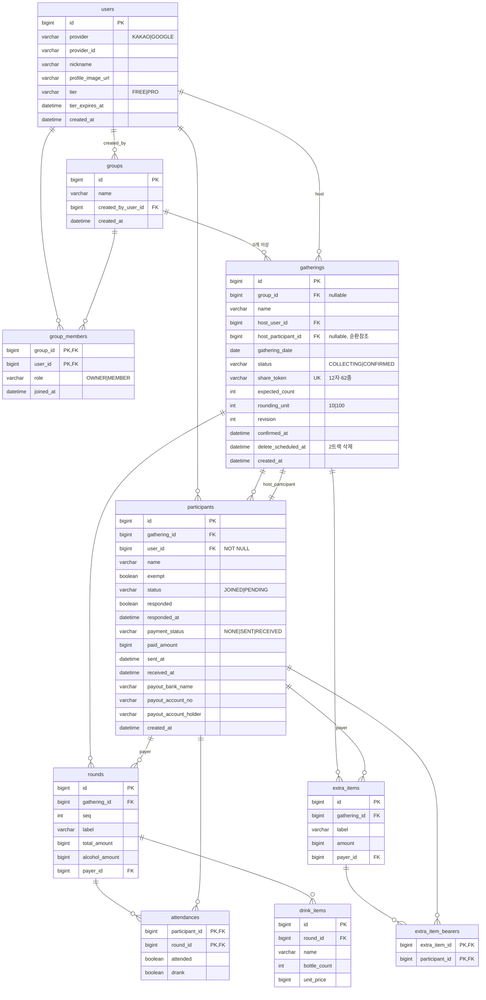

# 정산어택 — ERD

> `server/src/main/resources/db/changelog/`의 Liquibase YAML을 손으로 옮긴 것이다.
> **스키마가 바뀌면 이 문서가 아니라 changelog를 먼저 고치고, 이 문서를 그에 맞춰
> 갱신한다** (`00-README.md` — 명세서는 손으로 쓰지 않는다의 정신을 ERD에도 적용).
>
> ⚠️ **아직 실행 검증 전이다.** Docker가 꺼져 있어 실제 MySQL에 이 changelog를
> 돌려보지 못했다. 문법·FK 방향은 손으로 검토했지만, `docker compose up` 후
> `liquibase update`로 한 번 실행해 확인할 것.

---

## 0. MySQL 전환에 따른 타입 재결정

`ADR-011`로 PostgreSQL → MySQL로 옮기면서, 예전에 확정했던 타입 결정 두 가지를
다시 봐야 했다.

### 예약어 충돌 — `user`, `group`을 복수형으로 피한다

**`USER`와 `GROUP`은 둘 다 MySQL 예약어다.** `USER`는 `CURRENT_USER()`·`GRANT` 등에,
`GROUP`은 `GROUP BY`에 쓰인다. 테이블명으로 그대로 쓰면 매 쿼리마다 백틱
(`` `user` ``)을 강제로 붙여야 한다.

**테이블명을 전부 복수형으로 통일해 피한다** — `users`, `groups`,
`gatherings`, `participants`, `rounds`, `extra_items`, `attendances` 등.
`USERS`·`GROUPS`는 예약어가 아니다. API 경로가 이미 복수형(`/gatherings`,
`/participants`)이라 REST 관례와도 맞는다. 도메인 개념 이름(`User`, `Group`)은
코드·문서에서 단수형 그대로 쓴다 — 바뀐 것은 물리 테이블명뿐이다.

### 시각 — `TIMESTAMPTZ` 대신 `DATETIME` + 애플리케이션 UTC 규율

2026-08-16에 *"시각은 `TIMESTAMPTZ`로 통일한다. 국내 서비스라 KST 고정이지만
나중에 후회가 없는 쪽을 골랐다"*고 정했다. **MySQL에는 `TIMESTAMPTZ`가 없다.**
대안은 둘이다.

```
TIMESTAMP   세션 time_zone 기준으로 자동 변환해 저장·조회. 1970~2038 범위 한정
            (Year 2038 문제 — 32비트 유닉스 타임과 같은 근본 원인)
DATETIME    변환 없이 입력값 그대로 저장. 1000~9999 범위. 시간대 정보가 없다
```

**`DATETIME` + "항상 UTC로 쓰고 항상 UTC로 읽는다"는 애플리케이션 규율을 쓴다.**
`TIMESTAMP`의 자동 변환은 편리해 보이지만, **커넥션의 세션 타임존 설정이 실수로
달라지면 과거에 쓴 값이 조용히 다르게 읽히는 사고**가 난다 — 원래 `TIMESTAMPTZ`를
고른 이유("나중에 후회가 없는 쪽")와 정반대다. `DATETIME`은 DB가 아무것도 안 하므로
이 사고 자체가 구조적으로 안 난다. 대신 애플리케이션이 항상 `Instant`(UTC)로
쓰고 읽어야 한다 — JPA에서 `Instant`/`OffsetDateTime` 필드를 쓰면 Hibernate가
이 규율을 강제한다.

**`gathering_date`는 이 논의와 무관하다.** `DATE` 타입으로, 애초에 시각이 없다
(`API.md` §0.2).

### 그대로 유지된 결정

- **금액: `BIGINT`.** 원화는 최소 단위가 1원, 소수 불필요 — MySQL/PG 무관하게 유효
- **id: `BIGINT`.** core 모듈이 `Long`으로 통일한 것과 그대로 대응(2026-08-16 미결 항목,
  이후 `id 타입을 Long 으로` 커밋으로 해결됨)

---

## 1. 전체 ERD



> `notification_outbox`는 다른 테이블과 관계가 없어(FK 없음) 위 다이어그램에서 뺐다.
> `id`·`type`·`payload(JSON)`·`status`·`retry_count`·`next_retry_at`·`created_at`·
> `sent_at` — `ADR-002` 참조.

---

## 2. 관계형 스키마 밖 — 채팅 (MongoDB)

`ADR-010`. 아래는 이 changelog의 대상이 아니다 — 스키마리스 컬렉션이고,
MongoDB Atlas(관리형, `ADR-012`)에 둔다.

```
chat_message
  groupId, meetingId, memberId    // meetingId 는 gatherings.id 를 가리킨다
  type: TEXT | IMAGE | EXPENSE | SETTLEMENT | JOIN | LEAVE | NOTICE
  message
  createdAt
```

---

## 3. 순환 참조 처리 — `gatherings.host_participant_id`

`gatherings`가 `participants`를 가리키고 `participants`가 `gatherings`를
가리킨다. Liquibase에서 두 테이블을 동시에 만들 수 없으므로, `003`에서
`gatherings`를 컬럼만 있고 FK는 없는 상태로 만들고, `participants`가 생긴
직후(`004`의 두 번째 changeSet)에 그 FK를 추가한다. 순서를 바꾸면
`db.changelog-master.yaml` 적용이 FK 오류로 실패한다.

---

## 4. DB 레벨 CHECK 제약을 쓰지 않은 이유

`status`·`provider`·`role`·`payment_status` 같은 열거형 컬럼에 MySQL `CHECK`
제약을 걸지 않았다 — `VARCHAR` + 주석(`remarks`)으로 허용값만 문서화했다.

**core `Validator`가 이미 34종 오류 코드로 저장 전에 전부 막는다**
(`API.md` §1.4). 정상 흐름에서 DB가 잘못된 값을 볼 일이 없다. DB `CHECK`
위반은 컨텍스트 없는 뭉뚱그린 오류를 던지는데, 애플리케이션은 이미
`roundId`·`participantId`까지 담은 구조화된 오류를 준다 — DB 제약이 이중
방어로 얻는 게 크지 않고, Liquibase 버전마다 `CHECK` 문법이 미묘하게 달라
실행 전 검증 없이 넣는 리스크만 커진다.

---

## 5. 다음 단계

- [ ] Docker 켜고 `liquibase update` 실행 — 문법·FK 순서 실제 검증
- [ ] `docs/table-spec.xlsx` 생성 — 이 changelog를 파싱해 5시트 생성(§6 스크립트)
- [ ] `server` 모듈을 `settings.gradle.kts`에 `include(":server")`로 추가
