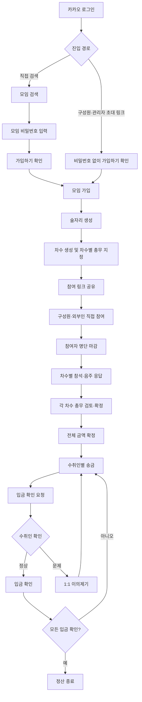
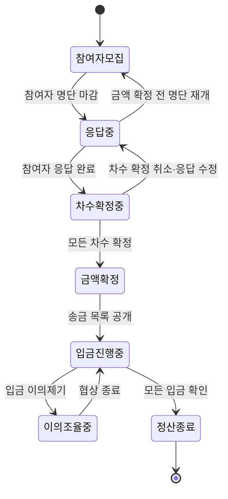
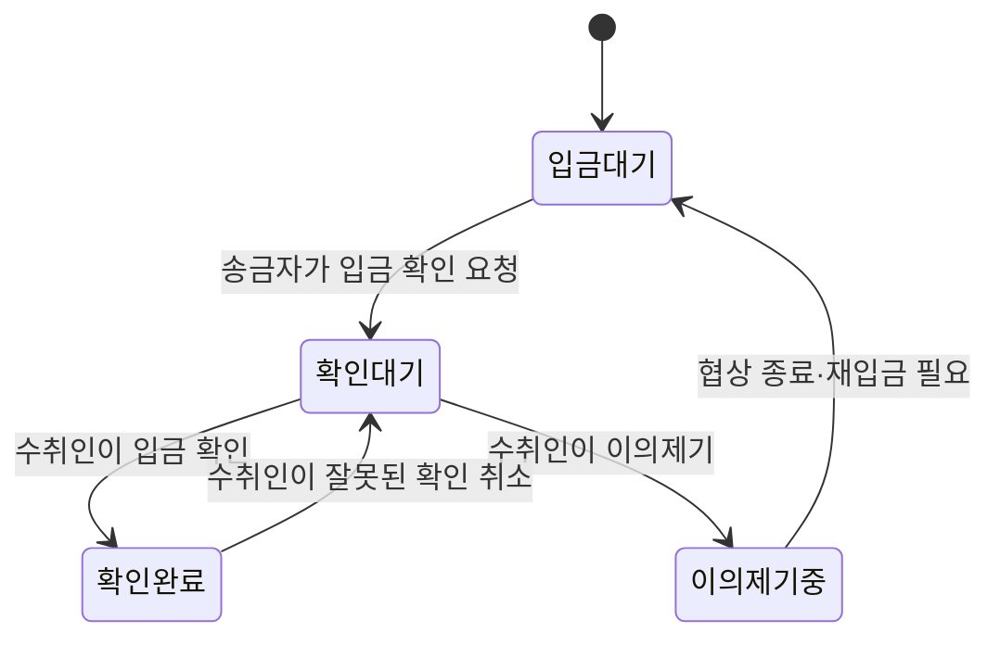

# 정산어택 — 제품 요구사항 정의서 · v1

> **상태:** 제품 요구사항 확정 · 기술 설계 반영 전  
> **작성일:** 2026-08-29  
> **적용 우선순위:** 이 문서는 새 제품 방향의 기준이다. 기존 `SPEC.md`,
> `CALC_RULES.md`, `ERD.md`, `API.md`와 충돌하면 이 문서의 제품 규칙을 우선하되,
> **코드는 관련 기술 문서를 개정한 뒤 변경한다.**

---

## 1. 제품 한 문장

**정산어택**은 모임의 각 차수 결제자가 영수증과 비용만 입력하고, 참여자들이
자신의 차수별 참석·음주 여부를 직접 제출해, 계산 근거부터 실제 입금 확인까지
끝내는 술자리 정산 서비스다.

### 해결하려는 문제

- 한 사람이 모든 참여자의 참석·음주 여부를 기억하고 입력해야 한다.
- 단순 N빵은 차수별 참석 여부와 논알코올 참여자를 제대로 반영하지 못한다.
- 계산된 금액만 전달하면 참여자가 자신의 금액을 신뢰하기 어렵다.
- 송금했다고 표시하는 것과 실제로 돈을 받은 것은 다르다.
- 잘못된 응답이나 입금은 결국 대화로 조율해야 하지만 기록과 상태가 분리돼 있다.

### 제품 원칙

1. **자기 정보는 참여자가 입력한다.** 총무가 미응답자의 답을 임의로 만들지 않는다.
2. **금액과 근거를 함께 보여준다.** 차수별 참석·음주와 부담 내역을 공개한다.
3. **차수별 결제자를 존중한다.** 각 차수 총무가 자신이 결제한 금액을 돌려받는다.
4. **금액 확정과 정산 종료를 구분한다.** 모든 입금을 확인해야 정산이 끝난다.
5. **푸시는 보조 수단이다.** 중요한 상태는 서비스 내부에도 반드시 기록한다.
6. **확정된 과거 기록을 지우지 않는다.** 탈퇴·강퇴·모임 보관이 정산 근거를 없애지 않는다.
7. **복잡한 기능보다 단순한 사용성을 우선한다.** 화면과 흐름은 꼭 필요한 기능에만 한정한다.

---

## 2. 유비쿼터스 언어

기획, 화면, 문서, 코드와 대화에서 아래 의미를 공유한다. 비슷한 단어를 임의로
섞어 쓰지 않는다.

| 한국어 | 코드 용어 | 정의 |
|---|---|---|
| 사용자 | `User` | 카카오 로그인을 완료한 서비스 회원 |
| 모임 | `Group` | 여러 사용자가 지속적으로 소속되는 공간. 여러 술자리를 가진다 |
| 모임 구성원 | `GroupMember` | 특정 모임에 지속적으로 가입한 사용자 |
| 모임 관리자 | `GroupAdmin` | 모임을 관리하는 유일한 구성원. 모임당 정확히 한 명 |
| 술자리 | `Gathering` | 특정 날짜에 발생한 하나의 정산 대상 행사 |
| 술자리 생성자 | `GatheringCreator` | 술자리의 차수와 초기 참여 구조를 만드는 사용자 |
| 차수 | `Round` | 술자리 안의 1차·2차 등 개별 결제 단위. 개수 제한이 없다 |
| 차수 총무 | `RoundManager` | 해당 차수의 유일한 결제자이자 수취인 |
| 술자리 참여자 | `GatheringParticipant` | 해당 술자리의 정산에 참여하는 사용자 |
| 외부 참여자 | `GuestParticipant` | 모임 구성원은 아니지만 특정 술자리에만 일회성으로 참여하는 로그인 사용자 |
| 차수 응답 | `RoundResponse` | 참여자가 특정 차수에 불참·면제·논알코올·알코올 중 하나를 제출한 정보 |
| 술 항목 | `DrinkItem` | 술 이름·병당 가격·병 수를 가진 주류 입력 항목 |
| 참여자 명단 마감 | `RosterClosed` | 새로운 술자리 참여를 막고 응답 대상을 고정한 상태 |
| 차수 확정 | `RoundConfirmed` | 차수 총무가 자기 차수의 비용과 응답을 검토해 고정한 상태 |
| 금액 확정 | `SettlementConfirmed` | 모든 차수 입력을 고정하고 송금 금액을 공개한 상태 |
| 입금 확인 요청 | `PaymentConfirmationRequested` | 송금자가 돈을 보냈다고 수취인에게 확인을 요청한 상태 |
| 입금 확인 | `PaymentConfirmed` | 실제 수취인이 입금액을 확인한 상태 |
| 이의제기 | `Dispute` | 응답 또는 입금 문제를 당사자끼리 조율하는 절차 |
| 정산 종료 | `SettlementCompleted` | 모든 입금이 확인되고 열린 이의제기가 없는 최종 상태 |
| 모임 보관 | `GroupArchived` | 기록은 유지하면서 신규 활동을 막고 기본 목록에서 숨긴 상태 |
| 모임 차단 | `GroupBan` | 강퇴된 사용자가 해당 모임에 다시 가입하지 못하도록 막은 상태 |

### 명칭 매핑

MySQL 예약어 때문에 제품 언어를 바꾸지 않는다.

| 계층 | 명칭 |
|---|---|
| 사용자 화면·한국어 문서 | 모임 |
| Kotlin 도메인 | `Group` |
| REST API | `/groups` |
| MySQL 물리 테이블 | `user_groups` |
| 구성원 관계 | `GroupMember` / `group_members` |

`UserGroup`은 모임 자체인지 사용자-모임 연결인지 모호하므로 도메인 클래스명으로
사용하지 않는다.

### 혼동하면 안 되는 표현

| 표현 | 의미 | 대신 쓰지 않을 표현 |
|---|---|---|
| 술자리 | 비용이 발생한 특정 날짜의 행사 | 모임, 정산방 |
| 정산 | 계산부터 입금 확인까지의 과정 | 술자리 |
| 금액 확정 | 송금할 금액이 고정됨 | 정산 완료 |
| 정산 종료 | 모든 입금까지 확인됨 | 금액 확정 |
| 차수 총무 | 해당 차수를 결제한 사람 | 전체 관리자, 방장 |

---

## 3. 역할과 권한

한 사용자가 동시에 여러 역할을 가질 수 있다. 예를 들어 모임 관리자가 술자리를
만들고 1차와 3차 총무를 맡을 수 있다.

### 3.1 모임 관리자

- 모임당 정확히 한 명이다.
- 최초 관리자는 모임 생성자다.
- 다른 모임 구성원에게 관리자 권한을 넘길 수 있다.
- 구성원을 강퇴하고 모임 차단을 해제할 수 있다.
- 모임을 보관하고 복구할 수 있다.
- 참여자 또는 정산 기록이 있는 모임을 물리적으로 삭제할 수 없다.
- 진행 중인 정산에서 차수 총무인 사용자를 강퇴할 수 없다.
- 관리자 권한을 넘기기 전에는 모임에서 탈퇴할 수 없다.

### 3.2 술자리 생성자

- 모임 구성원 누구나 술자리를 생성할 수 있다.
- 생성과 동시에 술자리 참여자가 된다.
- 술자리 날짜와 진행된 차수를 등록한다.
- 생성자를 1차 총무로 기본 지정하되, 금액 확정 전까지 변경할 수 있다.
- `모든 차수를 내가 결제했어요`를 선택하면 현재 및 이후 차수의 총무를 자신으로 지정한다.
- 각 차수 총무를 지정하거나 변경한다.
- 참여 링크를 만들고 참여자 명단을 마감한다.
- 술자리 전체 비용을 임의로 계산하지 않는다. 서버가 확정된 차수를 모아 계산한다.

### 3.3 차수 총무

- 한 차수에 정확히 한 명이 존재한다.
- MVP에서는 모임 구성원만 차수 총무가 될 수 있다. 외부 참여자는 맡을 수 없다.
- 해당 차수의 전체 비용을 혼자 결제한 사람이다.
- 한 사용자가 여러 차수의 총무가 될 수 있다.
- 해당 차수의 영수증·총액·술 이름·병당 가격·병 수를 입력한다.
- 해당 차수의 참여자 응답을 검토하고 필요한 경우 이의를 제기한다.
- 해당 차수 참여자 전원의 응답이 끝나야 차수를 확정할 수 있다.
- 전체 금액 확정 전에는 차수 확정을 취소하고 다시 수정할 수 있다.
- 해당 차수에서 본인을 제거할 수 없다.
- 진행 중인 정산을 맡고 있는 동안 모임에서 강퇴될 수 없다.
- 자신이 담당한 차수의 부담액을 실제로 받는 수취인이다.

> **MVP 제약:** 한 차수는 총무 한 명이 전액을 결제했다고 가정한다. 실제로는
> 여러 명이 나눠 결제했다면(분할 결제) 그 결제 건수만큼 차수를 나눠 등록한다
> (예: `1차-A`, `1차-B`). 확정된 수취 금액을 여러 번에 걸쳐 나눠 받는 것과는
> 무관한 제약이다 — 그건 입금 쪽 문제이지 이 제약이 막는 대상이 아니다.

### 3.4 모임 구성원

- 모임을 검색하거나 링크로 찾아 비밀번호를 입력해 가입한다.
- 모임의 술자리를 생성할 수 있다.
- 술자리 링크를 외부인에게 공유할 수 있다.
- 술자리에 직접 참여하고 차수별 응답을 제출한다.
- 자신의 계산 근거와 송금 목록을 조회한다.
- 송금 후 입금 확인을 요청하고, 자신이 당사자인 이의제기에 참여한다.
- 관리자 권한이 없으면 강퇴·차단 해제·모임 보관을 할 수 없다.

### 3.5 외부 참여자

- 카카오 로그인을 완료한 사용자만 가능하다.
- 모임 구성원이 되지 않고 초대받은 술자리에만 일회성으로 참여한다.
- 해당 술자리의 응답·결과·입금 확인·이의제기 기능을 사용한다.
- 모임의 다른 술자리나 전체 구성원 정보는 조회하지 못한다.
- 현재 술자리에서 제외되면 그 술자리에 다시 참여할 수 없다.
- 모임의 영구 블랙리스트 대상으로 관리하지 않는다.

### 3.6 권한표

`본인`, `담당 차수`, `당사자` 조건은 서버에서 항상 검증한다.

| 기능 | 모임 관리자 | 술자리 생성자 | 차수 총무 | 구성원 | 외부 참여자 |
|---|:---:|:---:|:---:|:---:|:---:|
| 관리자 권한 넘기기 | O | 권한 보유 시 | 권한 보유 시 | X | X |
| 구성원 강퇴·차단 해제 | O | 권한 보유 시 | X | X | X |
| 모임 보관·복구 | O | 권한 보유 시 | X | X | X |
| 술자리 생성 | O | O | O | O | X |
| 차수 생성·총무 지정 | 권한 보유 시 | O | X | X | X |
| 참여 링크 공유 | O | O | O | O | X |
| 참여자 명단 마감·재개 | 권한 보유 시 | O | X | X | X |
| 차수 비용 입력·확정 | 담당 차수만 | 담당 차수만 | 담당 차수만 | X | X |
| 차수 응답 제출 | 본인만 | 본인만 | 본인만 | 본인만 | 본인만 |
| 입금 확인 요청 | 송금 당사자 | 송금 당사자 | 송금 당사자 | 송금 당사자 | 송금 당사자 |
| 입금 확인·이의제기 | 수취인일 때 | 수취인일 때 | 수취인일 때 | 수취인일 때 | 수취인일 때 |
| 이의제기 채팅 | 당사자만 | 당사자만 | 당사자만 | 당사자만 | 당사자만 |

---

## 4. 핵심 사용자 흐름



### 4.1 로그인과 모임 가입

1. 사용자는 카카오로 로그인한다(신규 사용자는 가입도 함께 이뤄진다).
2. 모임에 들어오는 경로는 둘로 나뉜다.
   - **검색**: 모임을 검색해 찾은 뒤 모임 비밀번호를 입력해야 다음 단계로
     넘어간다.
   - **초대 링크**: 모임 관리자나 기존 구성원이 보낸 링크로 들어오면
     비밀번호 없이 바로 가입 확인 단계로 넘어간다.
3. 두 경로 모두 마지막에는 `가입하기`를 직접 눌러야 가입이 완료된다 — 링크를
   열었다는 사실만으로 자동 가입되지 않는다.
4. 차단된 사용자는 검색·비밀번호·초대 링크 어느 경로로도 가입할 수 없다.
5. 관리자가 차단을 해제해야 다시 가입할 수 있다.

> [!NOTE]
> 초대 링크를 비밀번호 없이 통과시키는 근거는 "발신자가 이미 이 사람을
> 선택해서 보냈다"는 것이다. 그 위에 비밀번호까지 요구하면 중복된 마찰이다.
> 검색으로 스스로 찾아온 사용자에게는 그런 발신자의 선택이 없으므로
> 비밀번호로 대신 검증한다.

비밀번호는 단방향 해시로 저장한다. MVP에서는 CAPTCHA나 장기 계정 잠금 같은
고급 방어는 도입하지 않는다.

### 4.2 술자리 생성과 참여

1. 모임 구성원이 술자리 날짜와 진행된 차수를 등록한다.
2. 1차 총무는 생성자로 기본 지정한다.
3. 생성자가 각 차수의 실제 결제자를 총무로 지정한다.
4. 구성원과 외부인은 공유 링크를 통해 술자리에 직접 참여한다.
5. 동일 사용자는 같은 술자리에 한 번만 참여할 수 있다.
6. 술자리 생성자가 명단을 마감하면 신규 참여를 막는다.
7. 전체 금액 확정 전에는 명단 마감을 취소해 누락된 참여자를 추가할 수 있다.

### 4.3 차수 입력과 참여자 응답

- 차수 개수에는 상한이 없다.
- 차수 총무는 영수증을 보고 총액과 주류 항목을 수동 입력한다.
- 주류 항목은 술 이름, 병당 가격, 병 수를 가진다.
- 참여자는 모든 차수에 대해 다음 넷 중 하나를 선택한다.
  - 불참
  - 참석·면제
  - 참석·논알코올
  - 참석·알코올
- 모든 참여자의 응답이 끝나기 전에는 차수를 확정할 수 없다.
- 총무가 참여자를 대신 응답하지 않는다.

### 4.4 금액 확정

1. 각 차수 총무가 자기 차수의 비용과 응답을 검토한다.
2. 필요하면 이의를 제기하고 참여자가 응답을 수정한다.
3. 차수 총무가 해당 차수를 확정한다.
4. 모든 차수가 확정되면 서버가 전체 송금 금액을 계산한다.
5. 금액 확정 직전에 변경 불가 항목을 명확히 안내한다.
6. 금액 확정 후에는 차수, 참여자, 총무, 참석·음주 정보와 비용을 변경할 수 없다.

> [!IMPORTANT]
> 차수 추가 마감 기준은 **전체 입금 완료가 아니라 금액 확정 시점**이다. 입금이
> 시작된 뒤 차수를 추가하면 이미 송금한 금액이 바뀌기 때문이다.

### 4.5 입금과 종료

1. 참여자는 수취인별로 표시된 금액을 직접 송금한다.
2. 송금 후 `입금 확인 요청`을 누른다.
3. 실제 수취인은 입금을 확인하거나 이의를 제기한다.
4. 잘못 확인했다면 수취인이 확인을 취소할 수 있고 변경 이력을 남긴다.
5. 모든 입금이 확인되고 열린 이의제기가 없으면 정산을 종료한다.

---

## 5. 상태 전이

### 5.1 술자리 정산 상태



### 5.2 변경 가능 범위

| 시점 | 참여자·차수 | 응답·비용 | 차수 총무 | 입금 상태 |
|---|---|---|---|---|
| 참여자 모집 | 추가·삭제 가능 | 입력 가능 | 지정·변경 가능 | 없음 |
| 응답 중 | 명단 재개 후 변경 | 수정 가능 | 변경 가능 | 없음 |
| 차수 확정 중 | 명단 재개 후 변경 | 확정 취소 후 수정 | 확정 취소 후 변경 | 없음 |
| 금액 확정 이후 | 변경 불가 | 변경 불가 | 변경 불가 | 요청·확인 가능 |
| 정산 종료 | 변경 불가 | 변경 불가 | 변경 불가 | 이력 조회만 가능 |

> [!IMPORTANT]
> 금액 확정 후 재정산은 MVP에서 지원하지 않는다. 누락이나 잘못된 입력은 금액
> 확정 전에 해결한다. 확정 후 발견된 문제는 당사자가 오프라인으로 조율하며,
> 후속 버전에서 별도 **추가 정산** 기능을 검토한다.

### 5.3 참여 응답 상태

```text
작성 중 → 응답 완료 → 차수 확정으로 고정
              └── 차수 확정 전 다시 수정 가능
```

참여자에게 응답 완료 시 다음 내용을 안내한다.

> 정산이 확정되기 전까지 응답을 수정할 수 있습니다. 차수 총무가 확정하면 더 이상
> 수정할 수 없습니다. 현재 내용으로 응답을 완료하시겠습니까?

### 5.4 입금 상태



---

## 6. 계산과 송금 규칙

### 6.1 차수별 부담

유리수 계산과 차수별 참석·음주 분배 원칙을 유지한다. 면제는 참여자 전체 속성이
아니라 차수별 응답 상태이며, 해당 차수의 모든 부담과 분모에서 제외된다.

```text
비주류 금액 = 차수 총액 - 주류 금액
비주류 부담 = 비주류 금액 / 해당 차수 참석자
주류 부담 = 주류 금액 / 해당 차수 음주자
```

동일 수취인에게 보낼 정확한 원부담을 먼저 합친 뒤 소수 부분이 있을 때만 1원 단위로
올린다. 10원·100원 단위 선택은 제거한다. 정확한 규칙은 `CALC_RULES_V2.md`를 따른다.

### 6.2 수취인별 합산

각 차수 부담액은 해당 차수 총무에게 귀속한다. 서로 다른 총무 사이의 채권을
전역으로 상계하지 않는다.

```text
참여자 P가 총무 M에게 보낼 금액
= M이 담당한 각 차수에서 P가 부담할 금액의 합
```

예:

```text
철수에게 42,000원
├─ 1차 부담액 30,000원
└─ 3차 부담액 12,000원

영희에게 18,000원
└─ 2차 부담액 18,000원
```

- 총무가 한 명이면 참여자는 그 총무에게 한 번만 송금한다.
- 총무가 여러 명이면 참여자는 수취인별로 각각 송금한다.
- 같은 총무가 여러 차수를 담당하면 정확한 원부담을 합친 뒤 한 번만 1원 단위로 올린다.
- 차수 총무 자신의 해당 차수 부담액은 받을 금액에서 제외한다.

> [!WARNING]
> 이 규칙은 현재 `CALC_RULES.md`와 core 엔진의 전역 greedy 상계 방식과 다르다.
> 구현 전에 계산 명세와 회귀 테스트를 먼저 개정해야 한다.

### 6.3 차수 순서

- 차수 `id`는 영구 식별자이며 재사용하지 않는다.
- `seq`는 화면 표시 순서이며 변경할 수 있다.
- 같은 술자리에서 `seq`는 중복될 수 없다.
- 중간 차수를 삭제하면 뒤 차수의 `seq`를 하나씩 당긴다.
- 참석 응답과 영수증은 `seq`가 아니라 차수 `id`를 참조한다.
- 금액 확정 후에는 차수 삭제와 순서 변경을 금지한다.

---

## 7. 이의제기와 조율

### 7.1 대상

사용자에게 정형화된 사유 선택을 강제하지 않는다. 다만 시스템은 연결 대상을
구분한다.

| 대상 | 예 | 종료 후 이동 |
|---|---|---|
| 차수 응답 | 참석했는데 불참으로 응답 | 응답 수정·차수 재검토 |
| 입금 | 미입금 또는 금액 불일치 | 입금 대기·재송금 |

### 7.2 앱 안에서 합의

```text
이의제기 시작
→ 당사자 1:1 채팅
→ 한쪽이 협상 완료 요청
→ 상대방이 동의
→ 협상 종료
```

- 협상 완료 요청 후에도 채팅할 수 있다.
- 새 메시지가 등록되면 대기 중인 완료 요청은 자동 철회된다.
- 상대방이 거절하면 계속 조율한다.
- 양측이 동의한 시각과 사용자를 기록한다.

### 7.3 미응답과 오프라인 조율

- 24시간 무응답: 1차 알림
- 48시간 무응답: 2차 알림 및 `장기 미응답` 표시
- 무응답을 자동 동의로 처리하지 않는다.
- 전화·대면·외부 메신저로 합의했다면 권한자가 `오프라인 조율 완료`를 누를 수 있다.
- 오프라인 종료는 양측 앱 동의와 구분해 기록한다.

오프라인 조율 방식은 `전화`, `대면`, `카카오톡`, `기타` 중 선택하고 메모는
선택적으로 남긴다.

---

## 8. 모임 관리와 기록 보존

### 8.1 강퇴와 차단

```text
모임 강퇴
→ 구성원 자격 제거
→ 모임 차단 등록
→ 검색·비밀번호·초대 링크 재가입 거절
→ 관리자가 차단을 해제해야 재가입 가능
```

- 진행 중인 정산의 차수 총무는 강퇴할 수 없다.
- 먼저 담당 차수를 다른 참여자에게 변경해야 한다.
- 불가피한 강제 조치는 운영자 문의로 처리한다.
- 강퇴해도 과거 정산 기록은 유지한다.

### 8.2 모임 삭제와 보관

- 참여자와 정산 기록이 전혀 없는 모임만 물리적으로 삭제할 수 있다.
- 참여자 또는 정산 기록이 있으면 `보관`만 가능하다.
- 보관한 모임은 기본 목록에서 숨기고 신규 술자리 생성을 막는다.
- 모임 관리자만 보관한 모임을 복구할 수 있다.

### 8.3 계정 탈퇴

- 진행 중인 정산의 차수 총무는 담당자를 변경하기 전 탈퇴할 수 없다.
- 완료된 정산 기록은 다른 참여자의 근거이므로 유지한다.
- 탈퇴자의 로그인 정보와 개인정보는 삭제 또는 익명화한다.
- 화면에는 `탈퇴한 사용자`로 표시한다.

### 8.4 보존 기간

MVP에서는 정산 기록에 자동 만료 기간을 두지 않는다. 개인정보와 법적 보존
정책은 운영 전 다시 결정한다.

---

## 9. 동시성과 중복 요청

동일 사용자의 중복 참여는 분산 락이 아니라 관계형 DB의 트랜잭션과 복합 유니크
제약으로 막는다.

```text
UNIQUE (gathering_id, user_id)
```

- 참가 버튼 더블클릭
- 모바일 네트워크 재시도
- 여러 브라우저 탭의 동시 요청
- 응답 유실 후 클라이언트 재요청

위 요청은 모두 같은 참여 결과를 돌려주는 멱등 동작으로 처리한다. 정원 제한처럼
여러 행의 조건을 동시에 보장해야 할 때만 술자리 행 잠금을 추가한다.

금액 확정 요청은 상태 조건과 입력 버전 또는 해시를 함께 검증해, 사용자가 확인한
내용과 서버가 확정하는 내용이 다르지 않게 한다.

---

## 10. 알림

### 채널

- 앱 사용자: FCM 앱 푸시
- 웹 사용자: FCM 웹 푸시
- 모든 사용자: 서비스 내부 알림함
- 초대: 사용자가 직접 보내는 카카오톡 공유 링크
- 카카오 알림톡: 비용과 운영 절차 때문에 MVP에서 제외

### 정책

- 일반 푸시는 사용자가 끌 수 있다.
- 정산 확정, 이의제기, 입금 확인 요청은 내부 알림을 항상 생성한다.
- 푸시 권한 거부나 발송 실패가 정산 처리 실패가 되어서는 안 된다.
- 알림 발송 실패는 재시도하되 비즈니스 트랜잭션과 분리한다.

### 주요 알림 이벤트

- 술자리 참여 요청
- 차수 응답 요청
- 24시간·48시간 미응답
- 차수 응답 이의제기
- 협상 완료 요청
- 전체 금액 확정
- 입금 확인 요청
- 입금 이의제기
- 모든 입금 확인 및 정산 종료

---

## 11. MVP와 후속 로드맵

### MVP

- 카카오 로그인
- 모임 검색·링크·비밀번호 가입
- 관리자 1명과 권한 이전
- 강퇴·모임 차단·해제
- 모임 보관·복구
- 구성원 및 외부 로그인 사용자의 술자리 직접 참여
- 무제한 차수와 차수별 총무
- 차수별 총액·술 이름·병당 가격·병 수 수동 입력
- 영수증 이미지 첨부
- OCR로 영수증에서 술 이름·병당 가격·병 수 자동 추출
- AI로 추출 항목을 주류 종류로 분류
- 총무가 자동 추출·분류 결과를 검토·수정한 뒤 확정(사람 검토 없이 자동 확정하지 않는다)
- 차수별 참석·음주 응답
- 참여자 명단 마감과 차수·금액 확정
- 수취인별 송금 금액 합산
- 응답·입금 이의제기와 1:1 채팅
- 양측 협상 종료와 오프라인 조율 종료
- 입금 확인 요청·수취인 확인·정산 종료
- 앱·웹 푸시와 내부 알림함

### 후속 기능

- 확정 후 별도 추가 정산
- 택시비·대리비 등 기타 항목
- 한 차수의 분할 결제
- 카카오 알림톡

### 장기 방향 — 제품 요구사항은 아니다

- **앱인토스(Apps in Toss) 등록.** 토스 앱 안에 미니앱으로 노출되는 토스의
  제휴 프로그램이다. 자체 PG·은행 라이선스가 필요 없고, 토스가 제공하는
  SDK·API로 로그인·화면을 연동해 등록 심사를 받는 방식이다. 인앱결제·인앱광고·
  토스 로그인으로 정산을 받으려면 사업자 등록이 필요하다. 아래 "만들지 않는
  것"의 "앱에서 실제 계좌 송금 실행"과는 다른 범주다 — 우리가 송금을 실행하는
  게 아니라 토스 생태계 안에 노출되는 것이다. MVP 범위에 넣지 않는다.

### 만들지 않는 것

- 앱에서 실제 계좌 송금 실행
- 은행 입금 내역 자동 조회
- 금액 확정 후 기존 정산을 직접 수정하는 기능
- 미응답을 자동 동의로 간주하는 기능
- AI가 사람의 검토 없이 영수증 결과를 자동 확정하는 기능

---

## 12. 핵심 불변식

> [!IMPORTANT]
> 아래 규칙은 화면 검증만으로 끝내지 않고 서버·DB·테스트로 보장한다.

1. 모임 관리자는 항상 정확히 한 명이다.
2. 한 차수의 총무는 항상 정확히 한 명이다.
3. 차수 총무는 해당 술자리 참여자다.
4. 같은 사용자는 같은 술자리에 중복 참여할 수 없다.
5. 모든 참여자가 응답하기 전에는 관련 차수를 확정할 수 없다.
6. 모든 차수가 확정되기 전에는 전체 금액을 확정할 수 없다.
7. 금액 확정 후에는 계산 입력을 변경할 수 없다.
8. 차수 총무별 수취 합계는 그 총무의 실제 결제액에서 자신의 부담액을 뺀 값과 일치한다.
9. 모든 최종 부담액의 합은 모든 차수와 기타 항목의 총액과 정확히 일치한다.
10. 모든 입금이 확인되고 열린 이의제기가 없어야 정산을 종료할 수 있다.
11. 강퇴·탈퇴·모임 보관은 확정된 정산 기록을 삭제하지 않는다.

---

## 13. 기존 문서·구현과의 차이

이 절은 구현 누락이 아니라 **의도적으로 기술 설계에 아직 반영하지 않은 변경 목록**이다.

| 영역 | 기존 기준 | 새 요구사항 |
|---|---|---|
| 정산 책임자 | 술자리 전체 주최자 한 명 | 차수별 총무 한 명씩, 전체 총무 없음 |
| 결제자 | 차수별 `payerId`, 전역 상계 | 차수 총무가 결제자·수취인, 총무별 합산 |
| 참여 마감 | `COLLECTING`에서 주최자 확정 | 명단 마감과 금액 확정 분리 |
| 미응답자 | 주최자가 대신 입력 가능 | 본인 응답 필수 |
| 확정 후 수정 | 재정산·추가금·환불 지원 | 기존 정산 수정 금지, 후속 추가 정산 검토 |
| 이의제기 | 공개 내역으로 자정 | 1:1 조율·양측 합의·오프라인 종료 |
| 입금 확인 | 전체 주최자가 확인 | 실제 수취인이 확인 |
| 외부 참여 | 링크 참여 | 카카오 로그인 후 술자리 단위 일회성 참여 |
| 모임 가입 | 초대 토큰 | 검색은 비밀번호 필요, 구성원·관리자 초대 링크는 비밀번호 생략 |
| 모임 관리 | OWNER/MEMBER | 관리자 1명, 권한 이전, 강퇴·차단·보관 |
| 채팅 | 일반 실시간 모임방, 보류 | 이의제기 당사자 1:1 채팅이 제품 흐름에 포함 |
| 알림 | 주최자 앱 중심 | 앱·웹 푸시 + 내부 알림, 알림톡 제외 |

### 기술 설계 반영 순서

1. `CALC_RULES_V2.md` — 차수 총무별 수취와 1원 올림 불변식 재설계
2. 상태 전이와 권한 모델 확정
3. Liquibase 신규 changelog 작성
4. 엔티티와 `ERD.md` 갱신
5. `API.md` 버전 상승 및 계약 개정
6. core 테스트를 먼저 수정·추가
7. server 구현과 성공·권한 실패 테스트 작성

기존 core와 server 코드는 이 순서를 끝내기 전까지 현재 계약대로 유지한다.
