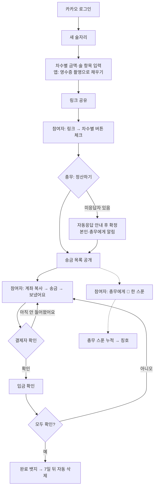
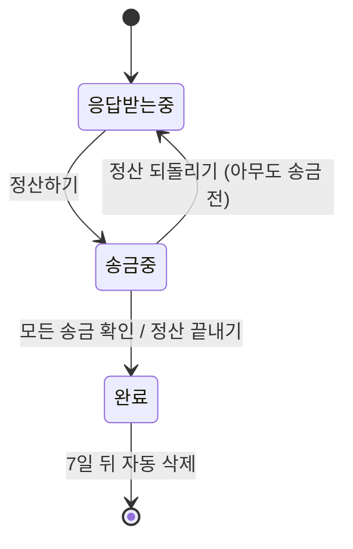
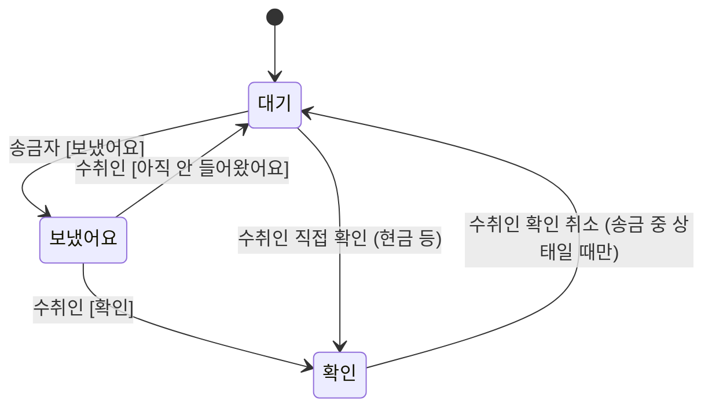

# 정산어택 — 제품 요구사항 정의서 · v3

> **상태:** 제품 요구사항 확정 · 기술 설계 반영 중
> **작성일:** 2026-08-29 · **개정:** 2026-09-29 (v3 단순화)
> **적용 우선순위:** 이 문서는 제품 방향의 기준이다. `SPEC.md`, `CALC_RULES.md`,
> `ERD.md`, `API.md`와 충돌하면 이 문서의 제품 규칙을 우선하되, **코드는 관련 기술
> 문서를 개정한 뒤 변경한다.**

> [!IMPORTANT]
> **v3 변경 요약 (2026-09-29).** v2는 모임(Group)·관리자·차단·확정 관문 3단계·1:1
> 이의제기 채팅까지 갖춘 무거운 구조였다. 실제 사용 장면을 다시 보니 **정산은 한 번
> 하고 끝나며, 사람들은 지난 기록을 찾지 않는다.** v3는 이를 기준으로 제품을 다시
> 잘랐다 — 모임 계층 제거, 술자리는 일회용(완료 7일 뒤 자동 삭제), 확정 관문 1개,
> 이의제기는 버튼 하나. 대신 정산방마다 **타임라인(채팅)**을 두고, 참여자가 총무에게
> **스푼(감사)**을 줄 수 있다. 변경 전후 비교는 §14, 결정 기록은 `ADR-019`·`DEVLOG.md`
> 2026-09-29.

---

## 1. 제품 한 문장

**정산어택**은 총무가 술자리를 만들어 링크를 뿌리면, 참여자가 자기 차수별
참석·음주를 버튼으로 체크하고, 계산된 금액을 보내고, 입금 확인까지 끝내는
**일회용 술자리 정산 서비스**다.

### 해결하려는 문제

- 한 사람이 모든 참여자의 참석·음주 여부를 기억하고 입력해야 한다.
- 단순 N빵은 차수별 참석 여부와 논알코올 참여자를 제대로 반영하지 못한다.
- 계산된 금액만 전달하면 참여자가 자신의 금액을 신뢰하기 어렵다.
- 누가 보냈고 누가 안 보냈는지 총무가 일일이 기억해야 한다.

### 제품 원칙

1. **버튼으로 끝난다.** 텍스트 입력은 금액·술 항목·첫 계좌 등록처럼 꼭 필요한 곳에만 둔다.
2. **사용자에게는 "지금 할 일 하나"만 보여준다.** 서버 내부 상태를 화면에 그대로 드러내지 않는다.
3. **일회용이다.** 정산이 끝나면 7일 뒤 사라진다. 기록 보관 서비스가 아니다.
4. **자기 정보는 본인이 체크한다. 단, 한 사람의 무응답이 전체를 막지 않는다.**
   응답하지 않은 사람은 정산 시점에 기본값으로 자동 처리하고 본인과 총무에게 알린다.
5. **금액과 근거를 함께 보여준다.** 차수별 참석·음주와 부담 내역을 공개한다.
6. **각 차수는 낸 사람에게 돌려준다.** 차수마다 결제자가 다를 수 있다.
7. **푸시는 보조 수단이다.** 중요한 상태는 서비스 내부 알림에도 기록한다.
8. **총무의 수고를 보이게 한다.** 총무는 계산하고, 돈 받아내고, 안 보낸 사람을 챙기는
   생색 안 나는 역할이다. 참여자는 버튼 하나로 감사(스푼)를 전하고, 쌓인 스푼은 칭호로
   다른 사람에게 보인다.

---

## 2. 유비쿼터스 언어

기획, 화면, 문서, 코드와 대화에서 아래 의미를 공유한다. v2의 21개에서 줄였다.

| 한국어 | 코드 용어 | 정의 |
|---|---|---|
| 사용자 | `User` | 카카오 로그인을 완료한 회원. 표시 이름과 받을 계좌를 한 번 등록해 재사용한다 |
| 술자리 | `Gathering` | 한 번의 정산 단위. 총무가 만들고, 끝나면 사라진다 |
| 총무 | `Host` | 술자리를 만든 사람. 술자리당 정확히 한 명 |
| 참여자 | `Participant` | 링크로 술자리에 들어온 사용자. 총무도 참여자다 |
| 차수 | `Round` | 1차·2차 등 결제 단위. 개수 제한 없음 |
| 결제자 | `Payer` | 그 차수 비용을 실제로 낸 사람이자 돌려받는 사람. 기본값은 총무 |
| 차수 응답 | `RoundResponse` | 차수별 불참·논알코올·알코올·면제 중 하나 |
| 자동응답 | `AutoResponse` | 정산 시점까지 응답하지 않은 칸에 들어가는 기본값(참석·알코올) |
| 술 항목 | `DrinkItem` | 술 이름·병당 가격·병 수 |
| 정산하기 | `Settle` | 총무가 금액을 고정하고 송금 목록을 공개하는 행동 |
| 송금 | `Transfer` | "누가 누구에게 얼마"의 한 건 |
| 완료 | `Completed` | 모든 송금이 확인된 상태. 완료 뱃지가 붙고 7일 뒤 삭제된다 |
| 타임라인 | `Timeline` | 정산방 안의 대화와 정산 진행 소식이 한 줄로 흐르는 화면. 정산방과 함께 삭제된다 |
| 스푼 | `Spoon` | 참여자가 총무에게 주는 감사 표시. "감사합니다, 한 스푼" |
| 칭호 | `HostTitle` | 총무가 받은 스푼 누적 수로 정해지는 표시(예: 새내기 총무 → 프로 총무) |

### 혼동하면 안 되는 표현

| 표현 | 의미 | 대신 쓰지 않을 표현 |
|---|---|---|
| 술자리 | 한 번의 정산 단위 | 모임, 그룹 |
| 총무 | 술자리를 만든 사람 | 방장, 관리자 |
| 결제자 | 그 차수를 낸 사람 | 차수 총무 (v2 용어, 폐기) |
| 정산하기 | 금액 고정 | 확정, 마감 |
| 완료 | 모든 입금 확인됨 | 정산 종료 |

> v2의 모임(`Group`)·모임 관리자·모임 차단·명단 마감·차수 확정·이의제기 용어는 v3에서
> 사용하지 않는다.

---

## 3. 역할과 권한

한 사용자가 여러 역할을 가질 수 있다. 총무가 2차 결제자가 아닐 수도 있고, 참여자가
2차 결제자일 수도 있다.

### 3.1 총무

- 술자리를 만들고 공유 링크를 뿌린다. 만드는 순간 참여자가 된다.
- 차수를 추가하고 차수별 금액·술 항목·결제자를 입력한다. 결제자 기본값은 본인이다.
- 참여자를 **차수별로 면제**할 수 있다(생일자, 쏘는 사람 등). 면제는 총무만 지정한다.
- **[정산하기]**를 누른다. 아무도 송금하기 전이면 **[정산 되돌리기]**로 수정 상태로 돌아갈 수 있다.
- 필요하면 **[정산 끝내기]**로 미확인 송금이 남아 있어도 완료 처리할 수 있다.
- 참여자를 술자리에서 제외할 수 있다(정산하기 전까지).

### 3.2 결제자

- 자기가 낸 차수의 부담액을 돌려받는다.
- 받을 계좌가 없으면 등록한다(한 번 등록하면 다음 술자리에서 재사용).
- 자기에게 온 송금을 **[확인]** 또는 **[아직 안 들어왔어요]**로 처리한다.

### 3.3 참여자

- 링크로 들어와 카카오 로그인한다(처음 한 번). 성을 포함한 실명을 직접 한 번 등록한다(FC-013).
  앞뒤 공백 제거 후 2~10 Unicode 코드포인트이며 최초 등록 후 변경하지 않는다.
  카카오 닉네임은 별도 보조 표시다. 목록은 `실명(닉네임)`, 문장은 실명만 사용한다.
- 차수별로 **[불참] [참석·논알코올] [참석·알코올]** 중 하나를 누른다. **[전 차수 똑같이]**로 한 번에 처리할 수 있다.
- 정산하기 전까지 응답을 바꿀 수 있다.
- 금액이 공개되면 근거를 보고, **[계좌 복사]** 후 송금하고 **[보냈어요]**를 누른다.
- 타임라인에 짧은 메시지를 남길 수 있다.
- 정산하기 이후 총무에게 **[🥄 한 스푼]**을 줄 수 있다(술자리당 한 번).

### 3.4 권한표

`본인`, `수취인`, `총무` 조건은 서버에서 항상 검증한다.

| 기능 | 총무 | 결제자 | 참여자 |
|---|:---:|:---:|:---:|
| 술자리 생성·공유 | O | - | - |
| 차수·금액·술 항목·결제자 입력 | O | X | X |
| 차수별 면제 지정 | O | X | X |
| 참여자 제외 | O | X | X |
| 본인 차수 응답 | O | O | O |
| 정산하기·되돌리기·끝내기 | O | X | X |
| [보냈어요] | 송금자일 때 | 송금자일 때 | 송금자일 때 |
| [확인]·[아직 안 들어왔어요] | 수취인일 때 | 수취인일 때 | 수취인일 때 |
| 타임라인 메시지 | O | O | O |
| [🥄 한 스푼] 주기 | X (자기 자신) | O | O |

---

## 4. 핵심 사용자 흐름


```mermaid
flowchart TD
    A[카카오 로그인] --> B[새 술자리]
    B --> C[차수별 금액·술 항목 입력<br/>앱: 영수증 촬영으로 채우기]
    C --> D[링크 공유]
    D --> E[참여자: 링크 → 차수별 버튼 체크]
    E --> F{총무: 정산하기}
    F -->|미응답자 있음| G[자동응답 안내 후 확정<br/>본인·총무에게 알림]
    F --> H[송금 목록 공개]
    G --> H
    H --> I[참여자: 계좌 복사 → 송금 → 보냈어요]
    I --> J{결제자 확인}
    J -->|확인| K[입금 확인]
    J -->|아직 안 들어왔어요| I
    K --> L{모두 확인?}
    L -->|아니오| I
    L -->|예| M[완료 뱃지 → 7일 뒤 자동 삭제]
    H -.-> N[참여자: 총무에게 🥄 한 스푼]
    N -.-> O[총무 스푼 누적 → 칭호]
```

정산방이 살아 있는 동안 모든 단계의 소식이 **타임라인**에 흐른다(§8).

### 4.1 총무 흐름

1. **[새 술자리]** — 이름은 자동 생성(예: "9/28 술자리"), 바꿀 수 있다.
2. 차수를 추가하고 금액을 넣는다. **앱은 영수증 촬영으로 총액·술 항목을 채울 수 있다**(§9).
3. 술 항목은 프리셋 칩(소주·맥주·막걸리 등)과 병 수 +/- 버튼으로 입력한다.
4. 다른 사람이 낸 차수면 **"누가 냈나요?"**에서 결제자를 고른다(기본값: 나).
5. **[링크 공유]** — 카카오톡으로 공유한다.
6. 참여자별 응답 현황을 본다. 아무 때나 **[정산하기]**를 누를 수 있다.
7. 받을 돈의 입금을 확인한다. 모두 확인되면 자동으로 완료된다.

### 4.2 참여자 흐름

1. 링크 → 카카오 로그인(처음 한 번) → 실명 등록(처음 한 번, 성공 뒤 참여 요청).
2. 차수별 버튼을 누른다. 필요하면 [전 차수 똑같이].
3. 정산되면 알림을 받는다. 내 금액과 근거를 본다.
4. **[계좌 복사]** → 송금 → **[보냈어요]**.
5. 결제자가 확인하면 알림을 받는다.
6. (선택) 총무에게 **[🥄 한 스푼]**. 끝.

### 4.3 화면 원칙

- 모든 화면의 최상단에는 **지금 이 사람이 할 일 하나**를 보여준다
  (예: "2차 응답을 남겨주세요", "민지님께 18,000원을 보내주세요", "3명 입금 확인 대기 중").
- 상태 이름(OPEN, SETTLING 등)을 사용자에게 보여주지 않는다.
- 각 사용자의 상태는 사용자별로 보인다 — 총무는 참여자별 응답·송금 상태 목록을,
  참여자는 본인 상태를 본다.

---

## 5. 상태

### 5.1 술자리


```mermaid
stateDiagram-v2
    [*] --> 응답받는중
    응답받는중 --> 송금중: 정산하기
    송금중 --> 응답받는중: 정산 되돌리기 (아무도 송금 전)
    송금중 --> 완료: 모든 송금 확인 / 정산 끝내기
    완료 --> [*]: 7일 뒤 자동 삭제
```

| 상태 | 참여 | 응답 수정 | 총무 입력 수정 | 송금 |
|---|---|---|---|---|
| 응답 받는 중 | 가능 | 가능 | 가능 | 없음 |
| 송금 중 | 불가 | 불가 | 불가 | 진행 |
| 완료 | 불가 | 불가 | 불가 | 조회만 |

- v2의 "명단 마감"과 "차수 확정"은 없다. **[정산하기] 한 번이 그 역할을 다 한다.**
- **정산 되돌리기**는 모든 송금이 한 번도 [보냈어요]·[확인]되지 않았을 때만 가능하다.
  돈이 움직이기 시작한 뒤의 실수는 당사자끼리 조율한다.

### 5.2 송금


```mermaid
stateDiagram-v2
    [*] --> 대기
    대기 --> 보냈어요: 송금자 [보냈어요]
    보냈어요 --> 확인: 수취인 [확인]
    보냈어요 --> 대기: 수취인 [아직 안 들어왔어요]
    대기 --> 확인: 수취인 직접 확인 (현금 등)
    확인 --> 대기: 수취인 확인 취소 (송금 중 상태일 때만)
```

- [아직 안 들어왔어요]를 누르면 송금자에게 알림이 가고, 송금자 화면에
  "OO님이 아직 입금을 확인하지 못했어요"가 뜬다. **그 이상의 조율 절차(채팅·협상)는 없다** —
  카카오톡으로 이야기한다.

---

## 6. 계산과 송금 규칙

정확한 규칙은 `CALC_RULES_V2.md`를 따른다. v3에서 계산 규칙은 바뀌지 않았다.

### 6.1 차수별 부담

```text
비주류 금액 = 차수 총액 - 주류 금액
비주류 부담 = 비주류 금액 / 해당 차수 참석자(면제 제외)
주류 부담   = 주류 금액   / 해당 차수 음주자(면제 제외)
```

- 면제는 해당 차수의 모든 부담과 분모에서 빠진다.
- 동일 수취인에게 보낼 정확한 원부담을 먼저 합친 뒤, 소수 부분이 있을 때만 1원 올린다.

### 6.2 수취인별 합산

각 차수 부담액은 그 차수 결제자에게 귀속한다. 서로 다른 결제자 사이를 상계하지 않는다.

```text
철수에게 42,000원
├─ 1차 부담액 30,000원
└─ 3차 부담액 12,000원

영희에게 18,000원
└─ 2차 부담액 18,000원
```

- 결제자가 한 명이면 참여자는 한 번만 송금한다.
- 결제자 자신의 해당 차수 부담액은 받을 금액에서 제외한다.

### 6.3 자동응답

- [정산하기] 시점에 응답이 없는 (참여자, 차수) 칸은 **참석·알코올**로 채운다.
- 총무는 정산하기 직전 확인 화면에서 "미응답 2명은 전 차수 참석·알코올로 계산돼요"를 보고,
  원하면 그 자리에서 바꿀 수 있다.
- 자동응답된 참여자 **본인과 총무 모두에게** 알림을 보낸다. 본인 화면에는
  "응답이 없어 참석·알코올로 계산됐어요" 표시가 붙는다.
- 잘못됐다면 총무가 [정산 되돌리기](아무도 송금 전일 때) 후 고친다.

### 6.4 계좌

- 결제자는 받을 계좌가 필요하다. 사용자 단위로 한 번 등록하고 재사용한다.
- 계좌를 등록하지 않은 결제자가 있어도 **정산은 진행된다** — 그 결제자에게 등록 알림이 가고,
  송금자 화면에는 "계좌 등록을 기다리는 중"이 뜬다. 한 사람 때문에 전체가 멈추지 않는다.

---

## 7. 완료와 삭제

- 모든 송금이 확인되면 술자리는 자동으로 **완료**된다. 총무가 [정산 끝내기]로 완료시킬 수도 있다.
- 완료된 술자리는 목록에 **"완료" 뱃지**를 달고 명확히 구분해 보여준다.
  "7일 뒤 사라져요"를 함께 표시한다.
- **완료 7일 뒤 술자리와 관련 데이터(차수·응답·술 항목·송금·해당 알림)를 물리 삭제한다.**
- **마지막 활동 후 30일이 지난 미완료 술자리도 삭제한다** — 방치된 술자리가 쌓이지 않게 하기 위한 안전망이다.
- 타임라인 메시지와 술자리별 스푼 기록도 술자리와 함께 삭제한다.
- 사용자 정보(표시 이름, 받을 계좌, **누적 스푼 수**)는 술자리와 함께 삭제되지 않는다.
- 계정 탈퇴 시 로그인 정보와 개인정보는 삭제한다.

---

## 8. 정산방 타임라인과 스푼

### 8.1 타임라인

정산방마다 **타임라인** 하나가 있다. 카카오톡 단톡방과 경쟁하는 일반 채팅이 아니라,
**정산 진행 소식이 대화 사이에 실시간으로 끼어드는 것**이 이 화면이 있는 이유다.

```text
⚙ 민지님이 정산했어요 · 1인 23,000원
재훈  아 2차 나 술 안 마셨는데 ㅋㅋ
민지  확인했어 되돌려서 고칠게
⚙ 재훈님이 보냈어요
⚙ 민지님이 입금 확인했어요
🥄 재훈님이 총무에게 한 스푼 줬어요
⚙ 모두 입금 완료! 🎉
```

- 참여자는 짧은 **텍스트 메시지**를 남길 수 있다. 이미지·파일은 지원하지 않는다.
- 시스템 소식(⚙)은 서버가 자동으로 넣는다 — 참여, 응답 완료, 정산하기, 자동응답,
  정산 되돌리기, 보냈어요, 입금 확인, 아직 안 들어왔어요, 스푼, 완료.
- 정산방이 삭제될 때(완료 7일 뒤 또는 30일 방치) **타임라인도 함께 삭제**된다.
- 타임라인은 이의제기 절차가 아니다. 협상 요청·동의·오프라인 조율 같은 절차는 두지 않는다.
- 새 메시지에 대한 푸시는 보내지 않는다(알림 피로). 시스템 소식 중 §10 알림 이벤트에 해당하는 것만 푸시한다.

### 8.2 스푼

참여자가 총무에게 버튼 하나로 감사를 전한다 — **"감사합니다, 한 스푼 부탁드려요"**.

| 항목 | 규칙 |
|---|---|
| 누가 주나 | 총무가 아닌 참여자 → 총무 |
| 언제 | [정산하기] 이후(송금 중·완료)부터 삭제 전까지 |
| 몇 개 | 참여자 한 명이 술자리당 **1스푼** |
| 총무 기본 스푼 | 술자리가 **완료**되고 참여자가 **2명 이상**이면 총무에게 1스푼 (빈 술자리로 쌓는 것 방지) |
| 쌓이는 곳 | **사용자 단위 누적.** 술자리가 삭제돼도 누적 수는 남는다 |

- 스푼을 받으면 총무에게 알림이 가고 타임라인에 소식이 남는다.
- 스푼은 **보여주기 전용**이다. 돈·상품·쿠폰으로 바꿀 수 없다.

### 8.3 칭호

누적 스푼 수로 칭호가 정해진다. 정산방에서 총무 이름 옆에 칭호와 스푼 수가 보인다
(예: `민지 · 🥄1,280 프로 총무`). 참여자 눈에 보여야 의미가 있다.

| 누적 스푼 | 칭호 |
|---|---|
| 0~99 | 새내기 총무 |
| 100~999 | 믿음직한 총무 |
| 1,000~9,999 | 프로 총무 |
| 10,000~ | 전설의 총무 · **순위 표시** |

- 경계값은 위 단계로 친다 — 100은 믿음직한, 1,000은 프로, 10,000은 전설.
- **전설 구간은 전설끼리의 누적 스푼 순위를 함께 보여준다**(예: `전설의 총무 · 3위`).
  스푼 수가 같으면 같은 순위다. 전설이 아닌 구간에는 순위를 보여주지 않는다.
- 참고 계산: 술자리 한 번에 쌓이는 스푼은 대략 (참여자 수 − 1) + 기본 1개다. 5명 술자리면
  약 5개라서, 믿음직한은 총무 약 20회, 프로는 약 200회, 전설은 약 2,000회에 해당한다.
  전설은 일부러 드물게 둔 구간이다.
- **픽셀 총무 캐릭터**(스푼이 쌓이면 옷·소품이 바뀜)는 후속 기능이다(§12).

---

## 9. 영수증 인식 (앱 전용)

- **앱(iOS·Android)에서만 제공한다.** 웹은 수동 입력만 지원한다.
- 추출 대상은 **총액과 주류 항목**뿐이다. 비주류는 총액에서 빼서 구하므로 품목별로 뽑지 않는다.
- 추출 결과는 입력칸에 미리 채워질 뿐이며, **총무가 확인해야 반영된다.** 자동 확정하지 않는다.
- 뽑은 주류 항목 합계와 영수증 총액을 대조해 맞지 않으면 강조 표시한다.
- 추출 방식(기기 내 OCR / 서버 OCR / 비전 LLM)과 개인정보 처리(카드번호·승인번호)는
  실제 영수증 샘플로 정확도를 측정한 뒤 결정한다.

---

## 10. 알림

### 채널

- 앱: FCM 앱 푸시 · 웹: FCM 웹 푸시 · 모두: 서비스 내부 알림함
- 초대: 사용자가 직접 보내는 카카오톡 공유 링크
- 카카오 알림톡: MVP에서 제외

### 알림 이벤트

| 이벤트 | 받는 사람 |
|---|---|
| 참여자가 응답을 남김 | 총무 |
| 정산하기 (금액 공개) | 참여자 전원 |
| 자동응답 처리됨 | 해당 참여자 본인 + 총무 |
| 계좌 등록 필요 | 계좌 없는 결제자 |
| [보냈어요] | 수취인 |
| [확인] | 송금자 |
| [아직 안 들어왔어요] | 송금자 |
| 정산 되돌리기 | 참여자 전원 |
| 완료 | 참여자 전원 |
| 🥄 스푼을 받음 | 총무 |

타임라인의 일반 메시지는 푸시하지 않는다(§8.1).

- 푸시 권한 거부나 발송 실패가 정산 처리 실패가 되어서는 안 된다.
- 알림 발송은 비즈니스 트랜잭션과 분리한다(outbox).

---

## 11. 동시성과 중복 요청

- 같은 사용자의 같은 술자리 중복 참여는 `UNIQUE (gathering_id, user_id)`로 막고, 중복 요청은 같은 결과를 돌려준다(멱등).
- [정산하기] 더블클릭은 술자리 상태 조건부 갱신과 정산 스냅샷 유니크로 한 번만 성공한다.
- 총무가 본 미리보기와 서버가 고정하는 내용이 다르지 않게 입력 버전(`inputRevision`)과 해시(`inputHash`)를 함께 검증한다.
- [보냈어요]·[확인] 더블클릭은 현재 상태를 조건으로 갱신하고, 같은 상태면 멱등 성공한다.

---

## 12. MVP와 후속

### MVP

- 카카오 로그인, 표시 이름·받을 계좌 1회 등록
- 술자리 생성(이름 자동) · 카카오톡 링크 공유
- 차수·금액·술 항목(프리셋 칩 + 병 수 버튼) 입력, 차수별 결제자 지정
- 총무의 차수별 면제 지정, 참여자 제외
- 참여자 차수별 3버튼 응답 + [전 차수 똑같이]
- [정산하기] + 자동응답 + [정산 되돌리기] + [정산 끝내기]
- 수취인별 송금액과 계산 근거
- [계좌 복사] · [보냈어요] · [확인] · [아직 안 들어왔어요]
- 완료 뱃지 · 완료 7일 뒤 자동 삭제 · 30일 방치 자동 삭제
- 앱·웹 푸시와 내부 알림함
- 영수증 촬영 → 총액·주류 항목 추출 (**앱 전용**, 사람 확인 필수)
- 정산방 타임라인(텍스트 메시지 + 시스템 소식)
- [🥄 한 스푼] · 누적 스푼 · 칭호 표시

### 후속 기능

- **픽셀 총무 캐릭터** — 누적 스푼에 따라 옷·소품이 바뀌는 캐릭터. **방향: 국자 총무(칭호 4단계와 1:1)**, 화면 규칙은 `SCREENS.md` §6
- 토스 송금 딥링크(금액 채워서 토스 열기) — "앱에서 송금 실행"과의 경계 검토 후 결정
- 자주 함께 마시는 사람 불러오기(반복 멤버) — 모임 계층 없이 해결하는 방향으로 검토
- 택시비·대리비 등 기타 항목
- 카카오 알림톡

### 장기 방향 — 제품 요구사항은 아니다

- **앱인토스(Apps in Toss) 등록.** 토스 앱 안에 미니앱으로 노출되는 토스의 제휴
  프로그램이다. 자체 PG·은행 라이선스가 필요 없고 SDK·API 연동 후 등록 심사를 받는다.
  아래 "만들지 않는 것"의 "앱에서 실제 계좌 송금 실행"과는 다른 범주다.

### 만들지 않는 것

- 모임(그룹) 기능 — 관리자, 가입, 검색, 비밀번호, 강퇴·차단, 보관
- 정산 기록 보관·검색 — 완료 7일 뒤 삭제가 원칙이다
- 이의제기 절차 — 1:1 채팅방, 협상 완료 요청, 오프라인 조율 기록
  (정산방 타임라인은 모두가 보는 한 줄 대화일 뿐 이의제기 절차가 아니다)
- 스푼을 돈·상품·쿠폰으로 바꾸는 기능 (보여주기 전용 — 금전 가치가 생기면 전자금융 규제 검토 대상이 된다)
- 이미지·파일 메시지
- 앱에서 실제 계좌 송금 실행, 은행 입금 내역 자동 조회
- 웹에서의 영수증 인식
- AI가 사람 확인 없이 영수증 결과를 자동 확정하는 기능

---

## 13. 핵심 불변식

> [!IMPORTANT]
> 아래 규칙은 화면 검증만으로 끝내지 않고 서버·DB·테스트로 보장한다.

1. 술자리의 총무는 정확히 한 명이고, 총무는 그 술자리의 참여자다.
2. 각 차수의 결제자는 정확히 한 명이고, 그 술자리의 참여자다.
3. 같은 사용자는 같은 술자리에 중복 참여할 수 없다.
4. 면제 응답은 총무만 설정한다. 참여자는 불참·논알코올·알코올만 설정한다.
5. [정산하기] 이후에는 계산 입력(차수·금액·술 항목·결제자·응답)을 바꿀 수 없다.
   바꾸려면 [정산 되돌리기]가 가능해야 한다.
6. [정산 되돌리기]는 모든 송금이 한 번도 [보냈어요]·[확인]되지 않았을 때만 가능하다.
7. 결제자별 수취 합계는 그 결제자가 낸 차수 총액에서 본인 부담액을 뺀 값과 일치한다.
8. 모든 최종 부담액의 합은 모든 차수 총액과 일치한다(1원 올림 차이는 `CALC_RULES_V2.md` 규칙을 따른다).
9. 완료된 술자리는 7일 뒤, 30일간 활동 없는 미완료 술자리는 그때 삭제된다. 타임라인·술자리별 스푼 기록도 함께 삭제된다.
10. 한 참여자는 한 술자리에서 총무에게 스푼을 최대 1개만 준다. 총무는 자기 자신에게 줄 수 없다.
11. 총무 기본 스푼은 술자리가 완료되고 참여자가 2명 이상일 때 한 번만 지급된다.
12. 사용자의 누적 스푼 수는 그 사용자가 받은 스푼의 합과 같다(술자리가 삭제돼도 줄지 않는다).

---

## 14. v2 → v3 차이

| 영역 | v2 | v3 |
|---|---|---|
| 구조 | 모임 → 술자리 두 겹 | 술자리 하나 (모임 없음) |
| 기록 | 영구 보존, 확정 기록 삭제 금지 | 완료 7일 뒤 삭제 |
| 가입 | 검색·비밀번호·초대 링크 3경로 | 술자리 링크 1경로 |
| 결제자 | "차수 총무" — 역할과 확정 의무를 가짐 | "결제자" — 데이터일 뿐, 확정 의무 없음 |
| 확정 관문 | 명단 마감 → 차수 확정 → 금액 확정 | [정산하기] 1회 |
| 상태 | 6개 + 역방향 전이 | 3개 |
| 미응답자 | 전원 응답 전 확정 불가 | 자동응답 + 본인·총무 알림 |
| 면제 | 참여자 본인 응답 | 총무가 지정 |
| 이의제기 | 1:1 채팅·협상·오프라인 조율·24/48시간 알림 | [아직 안 들어왔어요] 버튼 |
| 대화 | 이의제기 당사자 1:1 채팅 | 정산방 타임라인 (모두가 보는 한 줄 대화 + 시스템 소식) |
| 총무 보상 | 없음 | 스푼·칭호 (후속: 픽셀 캐릭터) |
| 용어 | 21개 | 15개 |
| 영수증 | MVP, 플랫폼 구분 없음 | MVP, **앱 전용** |

### 기술 설계 반영 순서

1. `CALC_RULES_V2.md` — 변경 없음 (용어만 "차수 총무" → "결제자")
2. `DOMAIN_DB_DESIGN_V2.md` — v3 기준으로 개정 (모임·이의제기 제거, 상태 3개, 삭제 정책)
3. `ADR-019` — 모임 계층 제거와 일회용 술자리 결정
4. Liquibase 신규 changelog (전역 changeSet id 규칙 준수 — `AGENTS.md` §7)
5. 엔티티와 `ERD.md` 갱신
6. `API.md` 버전 상승 및 계약 개정
7. 서버 구현과 성공·권한 실패 테스트

기존 core와 server 코드는 이 순서를 끝내기 전까지 현재 계약대로 유지한다.
