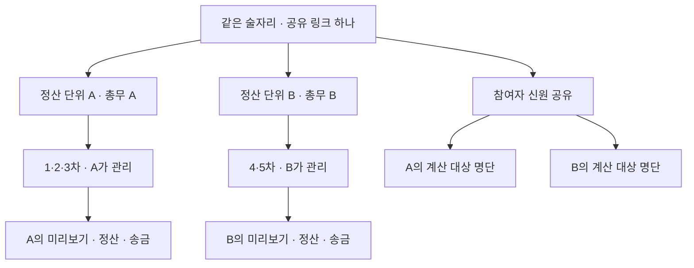

# 같은 술자리의 총무별 독립 정산 — 제품 v4 구현 계약

> **결정:** CTO, 2026-10-06. 같은 술자리에서 추가 차수에 새 총무를 두고 참여자를 재사용한다.
> **상태:** 요구사항·계산 호출·논리 DB·API 설계. 서버 기능과 마이그레이션은 아직 구현되지 않았다.
> **관련:** [REQUIREMENTS](REQUIREMENTS.md), [Core v2](CALC_RULES_V2.md),
> [ADR-020](ADR/020-independent-settlement-units.md), [FC-015](flow-changes/2026-10-06-next-round.md).
>
> 이 문서는 아래 범위에서 제품 v3의 **술자리당 총무 1명·전역 정산 상태·전역 입력 버전**을 대체한다.
> 인증·실명·금액 표현·계좌 공개 규칙 등 범위 밖 계약은 기존 문서를 따른다.

## 1. 요구사항과 권한

**술자리(`Gathering`)는 공유 링크와 참여자 신원을 공유하는 일회용 공간이다.**
그 안의 **정산 단위(`SettlementUnit`)**가 총무, 담당 차수, 계산 대상 명단, 정산 상태를 가진다.
화면에서 사용자가 새 술자리를 만들거나 새 링크로 재참여할 필요는 없다.



### 1.1 기본 흐름

1. A가 술자리를 만들면 A의 첫 정산 단위를 함께 만든다. A는 첫 참여자다.
2. A는 같은 단위에 1·2·3차를 추가한다. 각 차수의 결제자는 기본적으로 A다.
3. B가 **[다음 차는 내가 계산했어요]**를 누르면 **같은 술자리 안에 B의 정산 단위**를 만든다.
4. 기존 참여자 중 새 차수의 계산 대상자를 선택한다. 같은 `participantId`를 참조하며 가입 행을 복제하지 않는다.
   기본 선택은 본인 B만으로 시작하고, 나머지는 명시적으로 선택한다. 새 명단은 기존 응답을 복사하지 않는다.
5. B의 첫 차수는 술자리 전체 순서에서 다음 번호(예: 4차)를 받는다. 참여자는 새 차수의 응답만 남긴다.
6. A는 1·2·3차, B는 4차 이후 자신의 단위를 각각 정산한다. A의 정산 여부와 무관하게 B가 진행할 수 있다.
7. 늦게 합류한 C는 같은 링크로 한 번 참여하고 **선택한 OPEN 단위에만** 들어간다.
   이미 정산된 A의 명단·분모·송금 스냅샷은 바뀌지 않는다.

**총무와 결제자를 구분한다.** A의 카드 문제로 2차만 B가 대신 결제한 경우에는
A의 단위 안에서 2차의 `payerParticipantId`만 B로 설정한다. B에게 A의 관리 권한을 주지 않는다.
B가 이후 차수의 관리를 맡는 경우에는 B의 단위를 새로 만든다. 결제자 변경만으로 총무를 자동 변경하지 않는다.

### 1.2 관리 범위

| 행동 | 권한과 범위 |
|---|---|
| 새 정산 단위 만들기 | 실명 등록을 마친 기존 활성 참여자가 **본인을 총무로** 생성. `hostUserId`를 요청으로 받지 않는다 |
| 차수 추가·수정·삭제, 대리 응답 | 해당 단위의 총무만. 다른 총무의 차수 수정·이동 금지 |
| 명단 추가·제외 | 해당 OPEN 단위의 총무만. 다른 단위의 명단과 공유 참여자 신원을 삭제하지 않는다 |
| 본인 응답 | 본인이 명단에 포함된 OPEN 단위의 차수만. 총무 대리 응답을 SELF로 덮을 수 있다(FC-014 D3) |
| 정산하기·되돌리기·끝내기 | 해당 단위의 총무만. 최초 술자리 생성자에게 전체 정산 관리 권한이 생기지 않는다 |
| 송금 보냄·입금 확인 | 해당 송금의 송금자·수취인만. 총무라는 이유로 다른 사람의 입금을 확인하지 않는다 |
| 제목·날짜 수정 | 최초 술자리 생성자. 계산 입력을 변경하지 않으며 정산 단위의 revision을 올리지 않는다 |
| 타임라인·참여자 신원 조회 | 술자리 참여자 공유. 금융 정보의 공개 범위는 기존 계좌 공개 규칙을 따른다 |

정산 단위는 결제자별 그룹과 다르다. 한 단위 안에 결제자가 여러 명일 수 있고,
같은 결제자가 서로 다른 단위에 존재해도 두 단위의 송금을 합치거나 상계하지 않는다.
이미 있는 단위의 총무를 바꾸는 **권한 양도 기능은 이번 범위에 없다**.

### 1.3 상태와 수명

`OPEN → SETTLING → COMPLETED` 상태는 **정산 단위**에 적용한다.
되돌리기는 해당 단위가 SETTLING이고 그 단위의 모든 송금에 보냄·확인 이력이 없을 때만 가능하다.
송금 0건 정산은 해당 단위를 바로 COMPLETED로 만든다. 빈 차수 목록은 정산할 수 없다.

술자리 요약 상태는 권한 검사에 쓰지 않는다. 단위들의 상태로 계산한다.

| 단위들의 상태 | 술자리 요약 `status` |
|---|---|
| 하나라도 OPEN | OPEN |
| OPEN은 없고 하나라도 SETTLING | SETTLING |
| 전부 COMPLETED | COMPLETED |

A가 SETTLING, B가 OPEN이면 A의 응답은 잠기고 B의 응답은 수정 가능하다.
화면은 각 차수의 `settlementUnitId`와 단위별 상태를 보고 행동을 결정한다.
술자리 요약 OPEN을 보고 A의 응답 수정을 허용하면 안 된다.

- 술자리 전체 완료 시각은 마지막 단위의 완료 시각이다. 그 시각부터 7일 뒤 **술자리 전체**를 삭제한다.
- 하나라도 진행 중이면 다른 단위가 먼저 끝났다는 이유로 술자리나 그 참여자를 삭제하지 않는다.
- 삭제 전 새 단위를 만드는 경우 기존 완료 단위를 다시 열지 않는다. 술자리 완료 시각과 삭제 예정 시각을
  비우고, 전체가 다시 완료된 때부터 7일을 계산한다. 이는 아래 §7의 명시적 설계 가정이다.
- 미완료 술자리는 마지막 활동 후 30일 삭제를 유지한다. 삭제 배치와 새 활동은 같은 술자리 잠금 아래에서 재검사한다.
- 타임라인은 술자리당 하나다. 정산 소식·알림에는 `settlementUnitId`를 넣어 담당 차수로 이동한다.

## 2. Core v2 호출 계약

Core에 총무 권한·DB·정산 상태를 넣지 않는다. 서버가 선택한 단위의 입력을 조립한 뒤 기존
`Settlement.settle(SettlementInput)`을 호출한다. Java와 Kotlin 양쪽에서 같은 계약을 구현하고 비교한다.

| 입력 | 단위 U에서 모을 것 |
|---|---|
| `participants` | U의 ACTIVE 명단에 포함된 공유 참여자. 총무 및 모든 결제자도 이 명단에 있어야 함 |
| `rounds` | U에 속한 차수만. 다른 단위의 차수 ID는 포함하지 않음 |
| `attendance` | 위 명단 × 위 차수. 빈칸은 미리보기에서는 DRANK로 투영하고, 정산 성공 시 AUTO로 저장 |
| `drinkItems` | 위 차수에 속한 술 항목만 |

Core의 `MISSING_ATTENDANCE` 검증 전에 명단 × 차수의 모든 키를 명시적으로 만든다.
명단에서 제외된 사람은 AUTO 대상도 아니다. 다른 단위에 존재한다는 이유로 사람을 포함하거나
다른 단위의 응답을 재사용하지 않는다. 단위에 차수가 없으면 서버 오류 `NO_ROUNDS`로 거절한다.

**한 단위 안에서** 동일 수취인의 정확한 원부담을 먼저 합친 후 1원 올림·잔액 조정을 한다.
서로 다른 단위 사이에는 동일 수취인이 있어도 합산하지 않는다. 총무와 잔액 조정자는 동일 개념이 아니다.
잔액은 기존 규칙대로 실제 결제자, 또는 그 결제자의 원부담이 0일 때 선정된 최다 부담자에게 조정한다.
잔액을 관리 총무에게 임의로 돌리지 않는다.

### 2.1 회귀 예제

| 사례 | 기대 결과 |
|---|---|
| A 단위: A/B/C, A가 낸 10,000원 차수 3개, 전원 SOBER | 올림 전에 합산. A/B/C 각각 10,000원, B→A·C→A 각각 10,000원 |
| 별도 B 단위: B/C, B가 낸 10,001원 차수 1개, 전원 SOBER | B 5,000원, C 5,001원, C→B 5,001원. A의 금액·revision은 그대로 |
| B의 새 차수 술값 > 총액 | B의 미리보기·정산만 실패. A의 정상 미리보기·정산은 성공 |
| A가 정산된 뒤 C가 B 단위에 새로 가입 | C의 신원은 공유. A의 기존 명단·금액·스냅샷은 그대로 |
| A 단위의 2차 결제자만 B | A가 관리. 수취인은 기존 Core 규칙대로 A/B로 분리 |
| 동일 수취인이 A/B 단위 모두에 존재 | 단위별 별도 송금 ID와 금액. 단위 사이 합산·상계 없음 |

송금 근거는 해당 단위·해당 수취인의 차수만 담는다(FC-014 D2).
표시용 정수 금액과 마지막 차수의 차이 보정은 Core의 표시 변환 계약으로 구현·검증하고,
서버나 프론트가 별도의 분배 공식을 만들지 않는다. 이 PR은 표시 변환 알고리즘을 변경하지 않는다.

## 3. 논리 스키마 — 아직 적용되지 않음

이 표는 **신규 migration 작성 전 설계**다. 물리 스키마의 진실은 Liquibase이며
[ERD](ERD.md)의 기존 실제 테이블이 이미 바뀌었다는 뜻이 아니다.
제품 v3 설계에서 이어지는 금액·응답·계좌 필드의 의미는 유지하고, 소유권과 상태 위치를 아래처럼 바꾼다.

| 테이블 | 소유권·제약·바뀌는 필드 |
|---|---|
| `gatherings` | 공유 제목·날짜·토큰·`created_by_user_id`·`next_round_seq`·마지막 활동·전체 완료 시각·삭제 예정 시각. 생성자는 전역 금융 관리자 아님. 전역 `input_revision` 폐기 |
| `participants` | 공유 신원. `UNIQUE(gathering_id,user_id)` 유지. 단위 제외 때문에 이 행을 REMOVED로 만들지 않음 |
| **`settlement_units`** | `id`, `gathering_id`, `host_participant_id`, `status`, `input_revision`, `completed_at`, `created_at`. 총무는 같은 술자리의 참여자. 총무별 단위 수 유니크 제약은 두지 않음 |
| **`settlement_unit_members`** | `settlement_unit_id`, `gathering_id`, `participant_id`, `status(ACTIVE/REMOVED)`, `joined_at`, `settlement_viewed_at`. `UNIQUE(settlement_unit_id,participant_id)`. 명단·읽음은 단위별 |
| `rounds` | `gathering_id`, **`settlement_unit_id`**, `seq`, `payer_participant_id`와 기존 금액 필드. `UNIQUE(gathering_id,seq)`. 차수를 다른 단위로 옮기지 않음 |
| `round_responses` | 공유 participant ID + round ID 유니크 유지. 응답 가능 여부는 해당 round의 단위 명단·상태로 검증 |
| `drink_items` | 해당 round의 자식. 단위 밖 항목이 계산 입력에 섞이지 않도록 round ID로 모음 |
| `settlements` | `gathering_id`, **`settlement_unit_id UNIQUE`**, 입력 revision/hash, grand total, 정산 실행자·시각. `gathering_id UNIQUE` 금지 |
| `settlement_transfers` | settlement의 자식. 기존 송금자·수취인·금액·상태·보냄/확인 이력 유지 |
| `settlement_transfer_items` | FC-014 D2의 불변 송금 근거. transfer ID, round ID, 응답 상태, 표시 금액. 다른 단위의 round 참조 금지 |
| `timeline_entries`, `notifications` | 공유 `gathering_id` + nullable `settlement_unit_id`. 공통 메시지는 단위 ID가 NULL. 정산 관련 이벤트는 단위 ID 필수 |

### 3.1 관계 무결성

- `participants`와 `settlement_units`에 `(id,gathering_id)` 복합 참조 키를 두고,
  unit의 host·member 및 round의 unit이 **같은 술자리**를 가리키도록 복합 FK를 건다.
- round의 payer는 `(settlement_unit_id,payer_participant_id)`로 unit membership을 참조한다.
  ACTIVE 여부와 총무·결제자 제외 금지는 애플리케이션에서 검증한다.
- 회원 신원과 이미 저장된 snapshot의 participant FK는 유지한다. 단위에서 제외하더라도 다른 단위의 FK를 끊지 않는다.
- 열거형은 VARCHAR + remarks, 검증은 애플리케이션. DB CHECK나 신규 의존성은 추가하지 않는다.
- 자식은 술자리 전체 삭제 시 함께 정리한다. 단위 완료 시 공유 participants를 삭제하지 않는다.

### 3.2 migration 작성 순서

1. 배포/병합 이력을 먼저 확인한다. 이미 적용된 changelog는 주석도 고치지 않는다.
2. `012`~`014`, changeSet `018`~`022`는 소진됨이다. 실명 PR의 `015-user-display-name.yaml`·
   changeSet `023`도 재사용하지 않는다. 그 PR 다음으로 작성한다면 **파일 `016-*`, 첫 id `024-*`**부터다.
   동시에 새 migration이 생겼으면 전역 id를 다시 확인한다.
3. 공유 술자리와 첫 단위를 만들 수 있는 기반 → 단위 명단·차수·응답 → 정산 snapshot·송금·근거 순서로 작성한다.
4. 적용 전 데이터가 있는 옛 술자리는 기존 생성자를 첫 단위의 총무로, 기존 차수·참여자를 그 단위로 옮긴다.
   Core v1의 기존 확정 송금 명세를 v2로 조용히 재계산하지 않는다. 호환되지 않는 확정 데이터 처리 여부는
   실제 DB 현황을 확인해 후속 migration PR의 확인 사항으로 남긴다.
5. 모든 컬럼 remarks와 배경 comment, master include, 엔티티, 실제 ERD를 같은 구현 PR에 갱신한다.

## 4. API v5 변경 계약 — 구현 예정

전체 경로는 `/api/v1` 아래다. 로그인은 기존 `@LoginUser`로 검증한다.
인증되지 않은 토큰 미리보기 외에는 로그인 필수. 이 변경으로 Bearer 인증을 도입하지 않는다.
FC-014의 앱 인증 제안과 기존 쿠키 전용 규칙의 충돌은 별도 인증 작업에서 해결한다.

### 4.1 읽기 모델

FC-014의 상세 `Gathering`을 아래처럼 개정한다. H1 목록도 같은 형식의 배열(D1)이다.
계좌 공개 규칙·타임라인 문구·실명 필드는 유지한다.

```jsonc
{
  "id": 101, "title": "10/6 술자리", "createdByUserId": 1,
  "status": "OPEN", "completedAt": null, "deleteScheduledAt": null,
  "participants": [{ "id": 11, "userId": 1 }, { "id": 12, "userId": 2 }],
  "settlementUnits": [
    { "id": 201, "hostParticipantId": 11, "status": "SETTLING", "inputRevision": 7,
      "participantIds": [11, 12], "completedAt": null,
      "me": { "included": true, "settlementViewed": false } },
    { "id": 202, "hostParticipantId": 12, "status": "OPEN", "inputRevision": 1,
      "participantIds": [11, 12], "completedAt": null,
      "me": { "included": true, "settlementViewed": false } }
  ],
  "rounds": [{ "id": 4, "seq": 4, "settlementUnitId": 202,
    "total": 10001, "payerParticipantId": 12, "drinks": [] }],
  "responses": [], "transfers": [], "timeline": []
}
```

이 JSON은 추가 필드를 보여주는 발췌다. 생략된 실명·nickname·payout 등의 기존 필드는 유지한다.
최상위 `hostUserId`·`inputRevision`·`me.settlementViewed`는 단위별 필드로 대체한다.
`createdByUserId`는 금융 권한 판정에 쓰지 않는다.
각 transfer에는 `settlementUnitId`를 추가한다. 상세·목록은 공유 술자리의 활성 참여자에게만 공개한다.

공개 `GET /join/{shareToken}`은 참여자의 이름·응답·계좌를 공개하지 않는다.
제목·날짜·인원 수와 `settlementUnits[{id,status,host{displayName,spoonCount},rounds[{id,seq,total}]}]`를 반환한다.
로그인이 필요한 `POST /join/{shareToken}`은 `{settlementUnitId,responses:[{roundId,type}]}`을 받는다.
선택한 OPEN 단위의 명단 추가와 응답을 한 트랜잭션으로 저장한다. 공유 참여자가 있으면 같은 ID를 재사용한다.
이미 그 단위의 ACTIVE 명단에 있다면 같은 참여 결과를 반환하고 응답을 덮어쓰지 않는다.
REMOVED 상태의 재참여는 총무가 명시적으로 다시 추가할 때까지 거절한다.

### 4.2 쓰기 API

아래 `U`는 `/api/v1/gatherings/{gid}/settlement-units/{uid}`다.
한 응답 요청에는 한 단위의 round ID만 허용한다. 여러 단위를 한 요청에서 수정하지 않는다.

| 요청 | 계약 |
|---|---|
| `POST /gatherings` | 공유 참여자와 초기 단위를 동시에 생성, 201 Gathering. 생성 본문은 FC-014 유지 |
| `POST /gatherings/{gid}/settlement-units` `{requestId,participantIds}` | 현재 사용자가 총무인 단위 생성. 공유 ACTIVE 명단 중 본인 필수. 201 Unit. 동일 requestId·본문은 같은 결과 |
| `PUT U/participants/{pid}` | 총무가 공유 참여자를 자신의 OPEN 단위에 추가. 중복은 멱등 |
| `DELETE U/participants/{pid}` | 해당 OPEN 단위에서만 제외. 해당 총무·결제자는 제외 불가. 공유 Participant 행 유지 |
| `POST U/rounds` `{total,payerParticipantId,drinks}` | 총무·OPEN. 전체 seq 채번, 201 Round. 기존 참여자의 새 차수 응답은 빈칸 |
| `PUT U/rounds/{rid}` / `DELETE U/rounds/{rid}` | 소유 단위·총무·OPEN 검사. 삭제 시 다른 단위의 seq를 당기지 않음 |
| `PUT U/responses/me` `{answers}` | 본인·명단 ACTIVE·OPEN. 참여자의 EXEMPT 입력 금지 |
| `PUT U/participants/{pid}/responses` `{answers}` | 총무 대리 응답, source=HOST. 면제 API는 보류 |
| `GET U/settlement/preview` | 총무. `{settlementUnitId,inputRevision,inputHash,lines,transfers}`. FC-002의 lines·transfers 모양 유지 |
| `POST U/settlement` `{inputRevision,inputHash}` | 총무·OPEN. 입력 비교 → Core → AUTO와 snapshot 저장. 200 Gathering |
| `DELETE U/settlement` | 총무·SETTLING, 해당 단위의 송금 이력 없음. 해당 snapshot·AUTO·열람 기록만 지우고 OPEN |
| `POST U/settlement/viewed` | 본인·해당 명단 ACTIVE·정산 존재. 단위별 최초 열람 기록, 204 멱등 |
| `POST U/complete` | 총무·SETTLING. 미확인 송금을 확인된 것으로 바꾸지 않고 단위 종료. 204 멱등 |
| `/transfers/{tid}/sent`, `/confirm`, `/not-received` | FC-014의 POST 유지. transfer → settlement → unit을 찾아 송금자·수취인·상태 검사 |

짧게 쓴 경로에도 `/api/v1`을 붙인다. `requestId`는 UUID이며 같은 user+Gathering 안에서 한 번만 사용한다.
같은 키에 다른 participantIds를 보내면 409다. 명단의 순서는 의미가 없으므로 정렬된 ID 집합으로 본문을 비교한다.
요청 기록은 단위와 같은 트랜잭션에 저장하고 술자리 삭제 시 함께 삭제한다.
이에 대응하는 `settlement_unit_requests(gathering_id,user_id,request_id,payload_hash,settlement_unit_id)`를
계획하며 `UNIQUE(gathering_id,user_id,request_id)`로 중복을 막는다.

다른 unit의 round ID를 URL에 넣으면 404다.
기존 전체 `/gatherings/{gid}/settlement`·`/responses/me`를 “마지막 단위”에 자동 연결하는 호환 API는 만들지 않는다.
전체 참가자 제외·전체 입력 revision·전체 차수 번호 당기기를 단위별 계약으로 대체한다.
술자리 전체 삭제 API도 이 계약에서 추가하지 않는다. 기존 레거시 삭제 API를 복수 총무의 데이터에 그대로 적용하지 않는다.

### 4.3 API 오류 코드 — 추가 예정

공통 오류 모양은 API.md §1.2다. Core Failure는 같은 절의 정산 검증 오류 배열로 변환한다.
아래는 설계 코드이며 현재 enum에 이미 구현되었다는 뜻이 아니다.

| HTTP | code | 조건 |
|---|---|---|
| 403 | `NOT_PARTICIPANT` | 공유 술자리의 활성 참여자가 아님 |
| 403 | `NOT_SETTLEMENT_UNIT_HOST` | 다른 총무의 단위 관리 |
| 403 | `NOT_SETTLEMENT_UNIT_MEMBER` | 해당 단위의 ACTIVE 명단에 없음 |
| 404 | `SETTLEMENT_UNIT_NOT_FOUND` | 지정 Gathering에 해당 unit 없음 |
| 404 | `ROUND_NOT_FOUND` | 지정 unit에 해당 round 없음 |
| 409 | `SETTLEMENT_UNIT_NOT_OPEN` | OPEN 전용 쓰기의 상태 불일치 |
| 409 | `SETTLEMENT_UNIT_NOT_SETTLING` | SETTLING 전용 작업의 상태 불일치 |
| 409 | `SETTLEMENT_INPUT_CHANGED` | 해당 단위의 revision/hash가 오래됨 |
| 409 | `TRANSFER_ALREADY_SENT` | 해당 단위의 송금에 sentAt/confirmedAt 이력 있음 |
| 409 | `REMOVE_HOST` / `REMOVE_PAYER` | 해당 단위 총무·결제자 제외 시도 |
| 409 | `NO_ROUNDS` | 차수가 없는 단위의 미리보기·정산 |
| 409 | `IDEMPOTENCY_KEY_REUSED` | 같은 requestId를 다른 본문에 사용 |

실명 미등록·금액 범위·계좌 미등록 오류는 기존 계약을 유지한다.
Core v2 오류는 전환 PR의 enum과 대조하여 API.md §1.4에 반영한다. 기존에 있는 코드를 중복 정의하지 않는다.

## 5. 트랜잭션과 동시성

### 5.1 입력 revision과 hash

revision은 해당 단위의 명단·총무·차수·금액·술 항목·결제자·응답이 바뀔 때만 올린다.
공유 참여자를 만들었다는 이유로 다른 단위의 revision을 올리지 않는다.
hash는 unit ID, ACTIVE 명단의 participant ID, 소속 round ID, 금액·payer·술 항목,
명단 × 차수의 유효 응답(빈칸의 DRANK 투영 포함)을 안정적인 ID 순서로 담는다.
별도 revision 비교도 유지한다. 제목·이름·타임라인·계좌·스푼·열람/확인 시각은 계산 hash에 넣지 않는다.

### 5.2 정산과 되돌리기

1. 대상 unit을 잠그고 총무·OPEN·revision/hash 일치·차수 존재를 검사한다.
2. 응답·명단 수정도 같은 unit 잠금을 사용한다. 입력을 배치 조회하고 Core를 실행한다.
3. Failure면 저장 없이 종료한다. Success면 투영한 AUTO, snapshot, 송금, 근거를 같은 트랜잭션에 저장한다.
4. 해당 unit을 SETTLING으로, 송금 0건이면 COMPLETED로 바꾼다. 해당 명단의 알림과 공유 타임라인을 저장한다.
5. Gathering을 잠그고 전체 unit의 최신 상태를 다시 읽어 전체 완료·삭제 예정·마지막 활동을 갱신한다.
6. 되돌리기·송금도 unit 잠금을 먼저 얻는다. 송금 후 되돌리기와 되돌리기 후 송금은 함께 성공할 수 없다.
   WAITING으로 돌아가도 sentAt/confirmedAt 이력을 지우지 않는다.

불변 송금 명세만 저장하고 미리보기나 일반 계산 결과를 DB에 저장하지 않는다(ADR-005/015).
다른 단위의 입력을 검증하지 않는다. B의 NO_ATTENDEE·MISSING_ATTENDANCE 때문에 A를 막지 않는다.
되돌리기에서 AUTO만 삭제하고 SELF·HOST 응답을 보존한다. 해당 단위의 revision을 올리고 열람 기록을 초기화한다.

### 5.3 잠금 순서와 전체 채번

- 단위 작업은 **unit → Gathering** 순서다. 여러 unit은 ID 오름차순으로 잠근 뒤 Gathering을 잠근다.
  Gathering을 먼저 잠그고 기존 unit을 잠그는 역순은 금지한다.
- 새 unit 생성은 기존 unit을 잠그지 않는다. Gathering을 잠그고 존재·삭제 여부를 확인한 뒤 자식을 삽입한다.
- 차수 채번은 unit → Gathering 순서로 `next_round_seq`를 원자적으로 증가시킨다.
  삭제한 번호는 재사용하지 않는다. 동시에 4차·5차를 만들어도 중복되지 않는다.
- 마지막 완료와 새 unit 생성은 Gathering 잠금으로 직렬화한다. 잠금 후 전체 unit의 최신 상태로 삭제 일정을 결정한다.
  단위 쓰기 트랜잭션은 READ COMMITTED에서 전체 상태를 일반 SELECT로 다시 읽는다.
  다른 unit에 FOR UPDATE를 붙여 잠금 순서를 뒤집지 않는다. 이 격리 선택은 동시성 테스트로 확인한다.
- 삭제 배치는 후보 조회 → 기존 unit ID 오름차순 잠금 → Gathering 잠금 → 명단·활동·완료·기한의 최신 재검사다.
  후보 조회 후 unit 추가·활동이 발견되면 삭제를 건너뛴다. 실제 부모 삭제에서 취하는 FK 자식 잠금도 동시성 테스트에 포함한다.
- 타임라인·알림의 Gathering FK도 공유 잠금을 취하므로 해당 자식 삽입 전에 Gathering 배타 잠금을 얻는다. 같은 방에서 두 unit이 FK 공유 잠금 뒤 배타 잠금으로 승격하면 교착한다.
- 다른 단위의 계산 revision은 무효화하지 않는다. 공유 행의 짧은 갱신 대기는 있을 수 있다.
- 명단·차수·응답은 IN 절 배치로 모으고 항목마다 쿼리를 날리지 않는다.
- 트랜잭션 안에서 외부 OAuth·알림 HTTP 호출을 하지 않는다. 알림 데이터를 저장한 뒤 전송한다.

## 6. 구현의 수락 조건

아래는 **실행 예정 시나리오**다. 통과한 테스트 수로 보고하지 않는다.

1. A SETTLING과 B OPEN이 한 Gathering에 공존하고 B 차수·응답만 수정할 수 있다.
2. A→B·B→A 관리 요청을 거절한다. 최초 생성자 A에게 B의 관리 특권이 없다.
3. B 차수·응답 변경·늦은 가입으로 A의 revision/hash/snapshot이 바뀌지 않는다.
4. B 계산 Failure와 무관하게 A 미리보기·정산이 성공한다. §2.1의 구체적인 금액도 확인한다.
5. 기존 참여자는 같은 participantId를 쓰고 재가입하지 않는다. 신규 C는 선택한 B 명단에만 들어간다.
6. 다른 결제자도 기존 수식으로 처리하며 Java/Kotlin 결과 전체와 오류 순서가 일치한다.
7. 동일 결제자가 다른 unit에 있어도 송금을 합산하지 않는다.
8. 동시 채번의 seq가 유일하고 B 차수 삭제로 A의 번호·hash가 바뀌지 않는다.
9. 동일 requestId 중복 생성은 단위 하나, 다른 본문은 409다. 다른 술자리의 host/member/payer FK도 거절한다.
10. A의 마지막 입금 확인과 B 생성이 경합해도 삭제 기한은 올바르게 비워진다.
11. A의 되돌리기와 송금은 하나만 성공한다. B의 송금 이력은 A의 되돌리기를 막지 않는다.
12. 삭제 배치와 단위 추가·참여·응답의 경합에서 진행 중인 단위나 공유 참여자를 잃지 않는다.
13. 다른 단위의 round ID를 URL에 넣어 참조·수정을 우회할 수 없다.
14. 각 신규 API의 성공+권한/검증 실패, 인증 가드, 기존 DB의 Liquibase 업그레이드를 검증한다.

## 7. 설계 가정과 확인 사항

**최소 가정:** 실명 등록된 기존 ACTIVE 참여자가 본인을 새 총무로 지정해 단위를 만든다.
원래 총무의 승인·권한 양도는 필요 없다. 계산 대상자는 명시적으로 고르고 총무 본인은 필수다.
다른 정책을 선택하면 생성 인가·초기 명단 처리만 변경한다.

1. **전체 완료 후 삭제까지 7일간 추가 차수를 시작할 수 있다**고 해석했다.
   금지한다면 단위 생성 인가 조건만 바꾸면 된다. 허용하면 전체 삭제 예정일이 연장될 수 있다.
2. **복수 총무의 스푼 회수·받는 사람·기본 한 개의 지급 시점은 미결이다.**
   기존 보상 규칙을 단위별로 기계적으로 복제하지 않는다. 단위를 늘려 보상을 늘리는 구조를 만들지 않는다.
   금융 기능과 분리하여 CTO 결정 후 스푼 API를 구현한다.

## 8. 구현과 PR의 순서

1. **이 계약 PR:** FC-015의 별개 술자리 제안을 바로잡고 공유/독립의 경계·API·DB·수락 조건을 정한다.
2. **기반 PR:** 실명 PR #10, Core v2 PR #7, Java판 PR #16의 의존성을 확인하고 신규 Liquibase,
   공유 참여자·단위·명단·차수·응답·인증 가드를 Java/Kotlin 각각 구현한다.
   Java 학습 구현은 별도 패키지에 두며 Spring Bean·URL을 중복 등록하지 않는다. 운영 진입은 Kotlin을 쓴다.
3. **정산 PR:** 단위 입력 조립·hash·Core 접속·snapshot·송금·되돌리기·완료를 양쪽에서 구현하고 §6을 검증한다.
4. **횡단 PR:** 공유 타임라인·단위별 알림·전체 삭제를 구현한다. 스푼은 §7의 결정 후 연결한다.
5. 코드 PR마다 확정 base/head와 diff를 보존하고 origin/main의 STUDY_POLICY/STUDY_CATALOG의 실제 항목으로
   Java·Kotlin 각각의 클래스/함수/변경 줄을 가리키는 가이드를 만든다. n8n 배포와 개발 후 학습을 모두 지원한다.
   이 문서 PR에는 Java/Kotlin 변경 코드가 없으므로 언어 학습 목차를 억지로 붙이지 않는다.

PR 생성은 기능 구현·출시 완료를 뜻하지 않는다. 병합과 운영 배포는 CTO가 한다.
